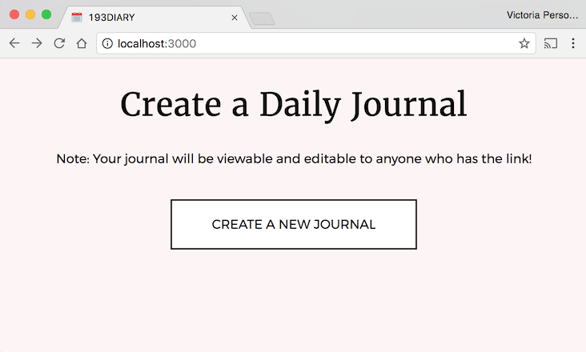
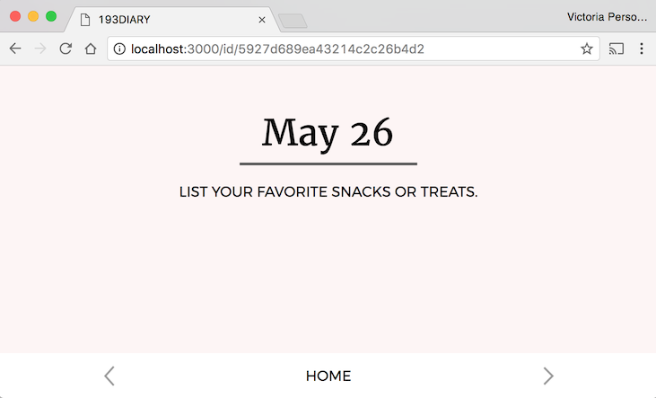
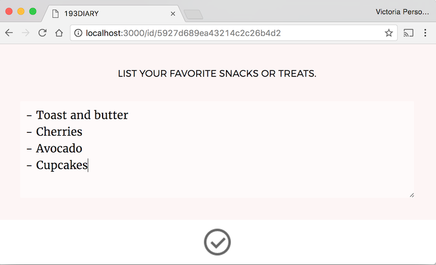
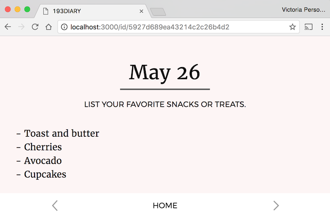
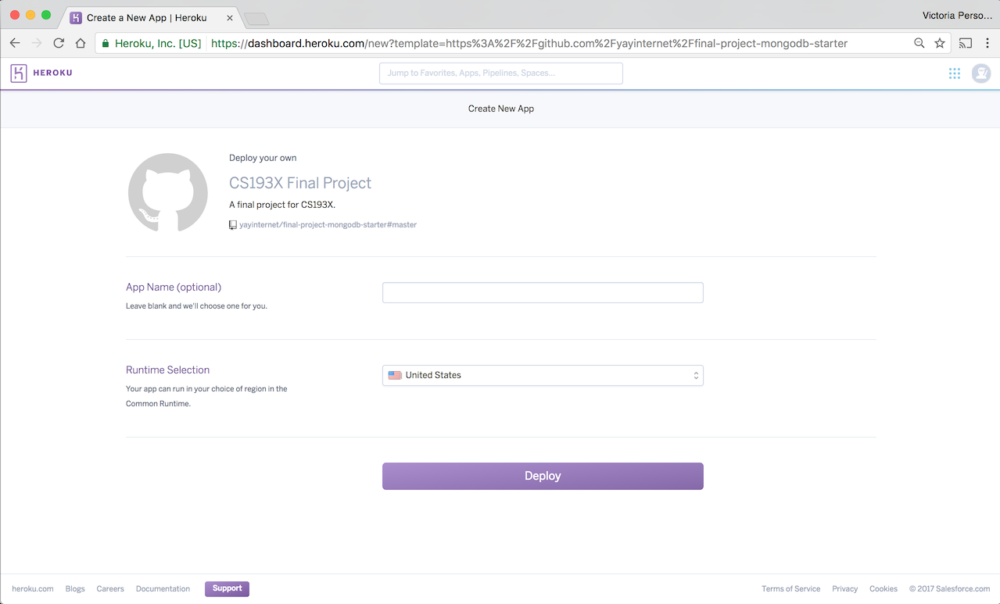
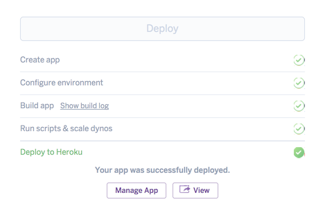
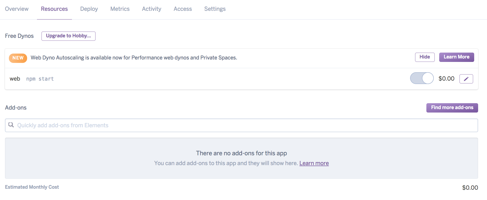
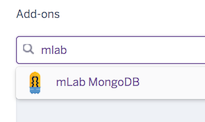
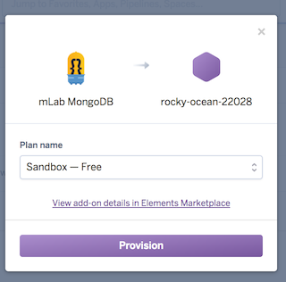
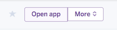


../

For the final project, you will be creating a web app using the key technologies
we have practiced throughout the quarter. Instead of giving you a specific web app to replicate, you are given the freedom to choose what you'd like to make.

We are giving you some restrictions on what you can make, such as a list of technical and style requirements. If you do not have any ideas for a web app you'd like to make, we've also provided a Diary project idea that you may use. If you choose to create the Diary app, it will be graded in the same way the other final projects are graded.

Like the homework assignments, the final project is individual and you may not work in pairs or groups.

Unlike the homework assignments, the final project **cannot be turned in late.**

Proposal Due Date: Fri, June 2, 2017 at 11:59pm (NO late submissions)  
Proposal Turn-in: [Submission Form](https://goo.gl/forms/THqiW6CaWlGBb7mB3)  
Final Project Due Date: Mon, June 12, 2017 at 11:59pm (NO late submissions)  
Final Project Turn-in: (coming soon)

---

* TOC
{:toc}

<section class="part" markdown="1">
## Project requirements

The final project is mostly open-ended, with some specific requirements as outlined in this section.

Overall, you can receive full credit on the final project if:
- Your project meets the Logistical, Technical, and Style requirements listed below.
- You successfully deploy your site to Heroku.
- You turn in the completed Project Proposal on-time (by June 2).
- You turn in your completed Final Project on-time (by June 12).

### 0. Logistical requirements
{:.no_toc}
- This is an individual assignment; you may not work in pairs or groups.
- There are two deadlines for the final project:
  - **Fri, June 2 @ 11:59pm:** Project Proposal is due
  - **Mon, June 12 @ 11:59pm:** Final Project is due
- NO late submissions will be accepted for either deadline.

### 1. Technology requirements
{:.no_toc}

In your final project, you **must** include the following technologies:

**Frontend: HTML/CSS**
- Use classes and ids
- Use `display: flex;`
- Include a CSS animation or transition
- Change 2+ default font properties
- Change 2+ box model properties (border, padding, margin)

**Frontend: JavaScript**
- Write object-oriented JavaScript
  - Include 2+ ES6 classes
  - Use at least one callback or Custom Event to communicate between classes
- Listen for 2+ events
- Use `fetch()` to talk to your backend

**Backend**
- Use Node and ExpressJS
- Save persistent data in some way using **either** MongoDB or a Google spreadsheet
  - We encourage you to use a MongoDB backend, but you may use a Google spreadsheet if that is a better fit for your project.
- Include at least 1 GET route
- Include at least 1 POST route, and it should include a message body
- Include at least one route parameter

**Misc**
- Use `async / await` properly somewhere in your project.
  - This can be in the frontend, backend, or both.
- You need to incorporate all these technologies into one cohesive web app.
  - We will **not** be grading on things like how interesting your project idea is, how original your idea is, how "realistic" it is, etc.
  - However, your project also can't be a set of totally nonsensical code that happens to hit our checklist of technologies. Your project should be a web app, even if it's a very small web app, or a silly web app, or a dumb web app.
- Your project should be relatively bug-free.
  - It's hard for us to judge whether you are using the technology correctly if your code is very buggy.
  - We will not deduct points for trivial bugs or polish bugs, but we will deduct points for things like if the one CSS animation you included in your project is not actually working.
  - This is another reason why you should **aim small** in your project scope.

### 2. Style requirements
{:.no_toc}

These style requirements should be no surprise, as we've enforced them all quarter.

**HTML/CSS:**
- Use tags semantically, e.g. don't use `
` for every single element on your page.
- No deprecated tags.
- Use descendent selectors to reduce redundancy in CSS and HTML
- You must write raw HTML and CSS, as we have done all quarter.
  - i.e. don't use SASS or compiled CSS/HTML

**JavaScript:**
- Must write object-oriented JavaScript.
- Must use ES6 classes.
- Avoid global variables.
  - OK to use globals for constants, instantiating classes, or other reasonable scenarios
  - But you should not put anything in a global variable that could be better encapsulated in a class
- Add/remove/toggle classes from `classList` instead of modifying `style` directly, unless you have to modify `style` directly (e.g. if you are calculating the value of a CSS property in JavaScript)
- Communicate between classes using callbacks or custom events.
- You must write raw JavaScript, as we have done all quarter.
  - You **may not** use jQuery.
  - You **may not** use any frontend frameworks, such as React, Angular ect.
  - You *may* use a library like the [dancer.js](https://github.com/jsantell/dancer.js/) library used in HW4.
  - You *may* query a 3rd party library such as the Giphy library used in HW4.

**Backend:**
- Your backend must be written using the Node and Express libraries
- Don't save data to the filesystem: persistent data should be stored in a MongoDB or a Google Spreadsheet.
- HTTP methods should be used in ways that are compatible with the method definition. For example:
  - Use GET for retrieving data. Do not write data in a GET handler.
  - Use POST for saving data. Do not use POST to display a page.
    - Don't use query parameters with POST

### 3. Publishing your site
{:.no_toc}

**Deploying:**
- You must successfully deploy your website on Heroku for turn-in.
- If you use a MongoDB backend:
  - You must use the mLab Heroku add-on. See the instructions in

**Browsers:**
- You must verify your site works on the latest version of Chrome.
- You do **not** have to make your site work on any other browser but the latest version of Chrome.

### Extra credit
{:.no_toc}

The following features are extra credit:
- Support user login using OAuth 2
- Mobile version
- Accessible website

### Things we are NOT grading
{:.no_toc}

We will NOT grade you on:
- The aesthetics of your web app
- Whether your web app is an interesting app idea
- Whether your web app is a creative app idea
- The technical difficulty of creating your web app
  - We **strongly** recommend you build something small and simple, roughly on par with the scope of the homework assignments.

While we are not grading you on the above aspects of your project, some of these things will be considered for the contest described below.

---

### Contest

We will be running a small contest for the final project submissions. The course staff will be selecting winners for the following categories:

- **Most beautiful:** Given to the most aesthetically pleasing final project
- **Best code:** Given to the final project with exceptionally well-written code
- **Most fun:** Given to a really fun final project
- **Best in show:** Given to the all-round most impressive final project

**If your final project is a contest winner, we will drop your lowest homework score.** We will also award you with a small prize.

</section>

<section class="part" markdown="1">
## Project ideas

You need to decide what web app you will build for the final project. Here are some suggested guidelines for you to follow when deciding what you want to build:

**Small and simple.**
- You only have a little over 2 weeks for this project, and programmers tend to grossly underestimate how difficult a task is / how long something will take to implement. Try to choose something very focused and simple for the subject of your final project.
- Choose something that feels similar in size and difficulty to one of the previous assignments in this class, or the Diary app described at the end of this section.

**No more than 3-5 different pages/screen in the entire app.**
- For example:
  - HW2: Quiz was 1 screen (the quiz)
  - HW3: Flashcards was 3 screens (menu, flashcards, results)
  - HW4: Music Box was 2 screens (menu, visualizer)
- We recommend you have **only 1 to 3 screens** in your web app, 5 at the absolute max.
- If your project involves more than 5 screens, it is probably too big in scope for the final project.

**Use previous HWs as your litmus test for scope and difficulty.**
- For example, if it took you 20+ hours to finish HW3, then you probably want to make something simpler than HW3. HW3 only involved writing JavaScript and did not include a backend or CSS, which you need to include on the final project.

**If in doubt, build the Diary app.**
- We've included below a project idea that fulfills the final project requirements: Diary.
- We will not grade the Diary app any differently than any other final project.
- If you are having trouble coming up with an appropriate final project idea, build the Diary app.

---

### Project idea: Diary

If you do not want to come up with your own project idea, implement the Diary app described below. This  fits all the technology requirements for the final project.

**Notes:**
- We will not grade the Diary app any differently than any other final project, i.e. you will not be penalized for choosing to implement the Diary app instead of original project idea.
- You do not have to make your Diary app look or behave exactly the way we've specified below.
  - Feel free to change the appearance, behavior, etc.
  - Of course, if you deviate from the Diary app described below, you need to make sure it still covers the technical requirements outlined at the beginning of the spec.
- The Diary app is not as thoroughly specified as previous homework assignments. This is intentional, since the final project is much more open-ended than previous assignments. If there is ambiguity in how the Diary app should behave, you can interpret in whatever way you choose. We will not be grading against how closely you followed our Diary spec.

### Diary behavior
{:.no_toc}

The Diary app is a web site that provides a way to make a simple, login-less journal. Every new journal has a unique URL that is viewable and editable by anyone with the link.

**Home Screen: Creating a new journal**
- When you go to the home page of your Diary app, you are presented with a button to create a new journal:
  
- When you press "Create a new journal":
  - Your app should create a new journal on the backend
  - The browser should navigate to `/id/<journal id>`, where **journal_id** is a unique id generated on the server. This is the permanent URL for the diary.
    - You can set `window.location.href = <URL>` to make the browser navigate to a URL.

**Diary Screen: Display today's journal**
- Navigating to `/id/<journal id>` should display today's journal entry for the journal identified by `<journal_id>`. When you first create a journal, the entry will be empty.
  
- Today's date is shown at the top of the screen, as is a journaling prompt for that day.
  - You will want to use the [`Date` class](https://developer.mozilla.org/en-US/docs/Web/JavaScript/Reference/Global_Objects/Date)

**Diary Screen: Update a journal entry**
- When you click on the space under the journal, you should be able to edit the diary entry.
  
- The entry should be saved when you click anywhere outside of the textarea, including the check box. This should also make the edit UI go away. ([VIDEO](videos/diary-edit.mp4))
  

**Diary Screen: Navigating between entries**
- At the bottom of the Diary Screen, there is a left and a right arrow. Click either arrow to go to the previous or the next day.
  <video src="videos/diary-nav.mp4" controls autoplay loop class="screenshot"></video>
- There is a different unique diary prompt for each unique day of the month.
- All days that you navigate to are editable. ([VIDEO](videos/diary-nav-edit.mp4))
- Clicking "Home" takes you back to the entry for today's date.

**Persistent data**
- The diary data should persist between reloads and server restarts
  - I.e. data should be stored in and loaded from a MongoDB backend or a Google Spreadsheet.

### Diary style and assets
{:.no_toc}

We are not going to spec out the diary app as specifically as previous homework assignments, since we are not grading you on how closely you followed our specification.

**Text properties:**
- Large heading: Date and "Create a Daily Journal" text:
  - Font face: Merriweather from [Google Fonts](https://fonts.google.com/specimen/Merriweather)
  - Size: 30pt
- Small text: Subtitle, Button text
  - Font face: Montserrat from [Google Fonts](https://fonts.google.com/specimen/Montserrat)
  - Size: 12pt
- Diary entry text
  - Font face: Merriweather from [Google Fonts](https://fonts.google.com/specimen/Merriweather)
  - Size: 14pt
  - Line height: 1.5em

**"Create a new journal" button**
- Border is 2px wide and black in color
- 20px of top-and-bottom space between the text and the border; 50px of left-and-right space between the text and the border
- Hovering over the button changes the button's font color to white and the background color of the button to black. The color transitions from white to black in 0.25 seconds.

**Background colors**
- Page background is `#fdf5f5`
- Textarea background color is white, with 50% opacity
- Footer background is white

**Assets**
- Images
  - [back.png](diary-assets/back.png)
  - [forward.png](diary-assets/forward.png)
  - [checked.png](diary-assets/checked.png)
- Journal prompts
  - [prompts.txt](diary-assets/prompts.txt)

</section>

<section class="part" markdown="1">
## Project Proposal

The Project Proposal is **due June 2 at 11:59pm**. It will be graded on completion.

### 1. Decide on a project idea
{:.no_toc}

Read the [project ideas](#Project-ideas) section of this spec and come up with an idea for your final project.

On the turn-in form, you will be asked to write a 1-2 paragraph description of your project idea.
- This doesn't have to be too long or descriptive, and it doesn't have to be a "pitch"; we just want to get a sense of what you want to make.
- If you are planning to make the Diary app, you can say so in a few words and you don't need to write a paragraph. Please elaborate if there's anything you plan on changing, though.
- We may reach out to you if we think your project is too difficult or otherwise inappropriate for the final project.

### 2. Accept the Final Project assignment
{:.no_toc}

Choose whether you want to have a MongoDB or a Google Spreadsheet backend, then accept the appropriate assignment below:

**Choose One:**
- [Starter code for MongoDB backend](https://classroom.github.com/assignment-invitations/c777c12c53ff638e81f117fece8a92fa) (RECOMMENDED)
- [Starter code for Google Spreadsheet backend](https://classroom.github.com/assignment-invitations/50b31e4fce4ef57dbdeee3fb7bc5d016)

### 3. Deploy the starter code to Heroku for practice
{:.no_toc}

Unlike HW5, you are **required** to deploy your final project to [Heroku](http://heroku.com). Practice doing so now so that we can work out any issues before the final project deadline.

- [Instructions to deploy to Heroku](#deploy-to-heroku--mlab)

### 4. Submit your project proposal and Heroku link
{:.no_toc}

When you are ready, submit your project proposal below:

- [Submit your Project Proposal](https://goo.gl/forms/THqiW6CaWlGBb7mB3)

</section>

<section class="part" markdown="1">
## Implementation milestones

After you've turned in your Project Proposal, you are now ready to begin implementation!

We suggest the following milestones for your project:

### Milestone 1: Implement the frontend UI with minimal-to-no CSS

**Create a class diagram for your frontend JavaScript**
- Before you begin any coding, write a class diagram for your frontend
- Suggestions:
  - Create an `App` class, similar to the `App` class in HW3 and HW4.
  - Make a new class for every screen in your app, similar to how that was done in HW3 and HW4.
  - Make a new class for every non-trivial UI element, similar to the `Flashcard` in HW3 or the `PlayButton` in HW4.

**Implement one screen at a time, without CSS**
- Write the HTML and JavaScript necessary to implement the behavior of one of the screens in your app. Implement one screen at a time. After each screen works individually, implement the interactions between the screens.
- Don't write your CSS yet, or at least don't spend too much time on CSS. You can make your web app prettier after you've gotten your web app working end-to-end.

**Use fake data instead of `fetch()`**
- In the areas where you are supposed to call `fetch()`, fake out the data that you could get from the `fetch()` call. You can fake the data by creating a hard-coded JavaScript object literal and using that as if you had retrieved that data from `fetch()`.

### Milestone 2: Design your database

**Decide how you are going to store your data**
- If you are using a MongoDB backend (recommended):
  - What collection(s) are you going to have?
  - What fields are you going to store in each object?
- If you are using a Spreadsheet backend:
  - What columns are you going to have?

**Write a non-server NodeJS test script to query your database**
- Before you touch your NodeJS server code, write a separate NodeJS script that queries and updates your database. This way you can make sure you know how to make the right calls to MongoDB, independent of your frontend or server code.
  - Example: [MongoDB scripts](https://github.com/yayinternet/mongodb-examples/tree/master/mongodb-scripts)
- This is just a test script, and it will not be directly connected to your project code in any way.

### Milestone 3: Implement the backend

**Move your frontend code to `public/`**
- Move the frontend code you wrote to the `public/` directory of your backend, if it's not there already
- Verify the frontend code is served statically from `public` when you run your NodeJS server

**Write "stubs" for your routes without involving data yet**
- Write stubs for all of your GET and POST handler(s), where you only do the following:
  - Specify the path for the route
  - Print out the parameters received
- Don't query/update your database or spreadsheet yet

**Connect your frontend to your backend**
- Modify your frontend code to query your server via `fetch()` with the appropriate parameters
- Make sure the backend prints the correct parameters when queried from the frontend.
  - Use `console.log()` statements on both the frontend and backend to debug

**Implement your routes**
- Now implement the rest of your stubbed routes, querying or updating your database or spreadsheet as necessary.

### Milestone 4: Finish your CSS

- After your website is working end-to-end, finish styling your frontend with CSS.

### Milestone 5: Deploy and test

- Re-deploy your website onto Heroku.
- Test out your deployed app to make sure it still works as expected.
- Go through the [Project Requirements](#project-requirements) and make sure your app fulfills all the ones we've asked for.

</section>

<section class="part" markdown="1">

## Deploy to Heroku + mLab

Here are instructions for deploying to [Heroku](http://heroku.com). Unlike in HW5, successfully deploying your final project to Heroku is **required**.

**Note: If you are using a MongoDB database, you need to do a few extra steps.** Please make sure to follow the extra steps below.

1. Create a [free Heroku account](https://signup.heroku.com), if you don't have one already
2. Once your account is created and verified, you can deploy your app by visiting the following link (of course, replace `<YOUR-REPOSITORY-NAME>` with the name of your repository):
  - `https://heroku.com/deploy?template=https://github.com/yayinternet/<YOUR-REPOSITORY-NAME>`
3. When the page loads, click the purple "Deploy" button.
  
4. When the deployment finishes, you should see "Your app was successfully deployed."
  

**If you have a Google Spreadsheet backend:**
- You're done! Click "View"
- This will take you to your deployed app, which will look like `http://some-autogenerated-name.herokuapp.com`

**If you have a MongoDB backend:**
- You will need to set up an mLab database. [mLab](http://mlab.com) provides hosting for MongoDB databases, and luckily, there is easy integration with Heroku.
- Click "Manage App" and continue the instructions below.

5. _(Mongo-only)_: Click on the "Resources" tab.
  
6. _(Mongo-only)_: Under "Add-ons", search for "mLab". When the option appears, click on it.
  
7. _(Mongo-only)_: A dialog box will pop up when you click on the mLab option. Click "Provision"
  
8. _(Mongo-only)_: Now your web app and database should be set up! Click "Open App" in the upper-right corner.
  

</section>

<section class="part" markdown="1">
## Submit

Submit the two project deliverables using the links below:

### June 2: Project Proposal
See [Project Proposal](#project-proposal) for details. Submission form below.
- [Submit form](https://goo.gl/forms/THqiW6CaWlGBb7mB3)

### June 12: Final Project
- [5/26: We will provide details on this in the next few days.]

</section>
