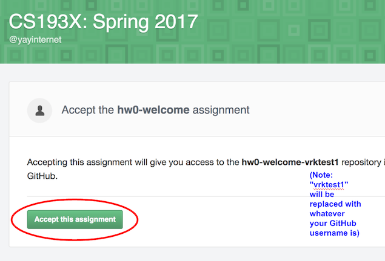
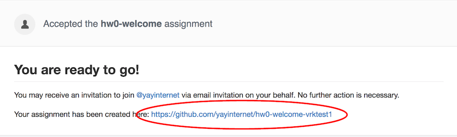
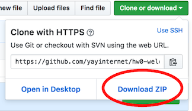
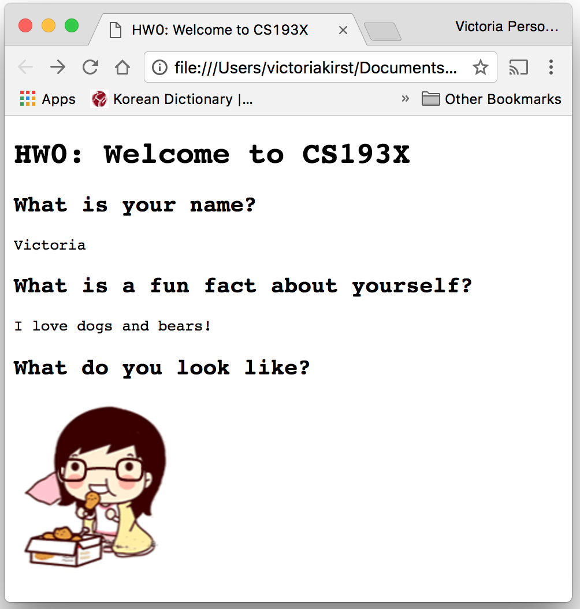
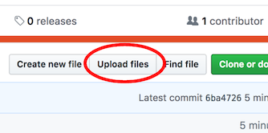
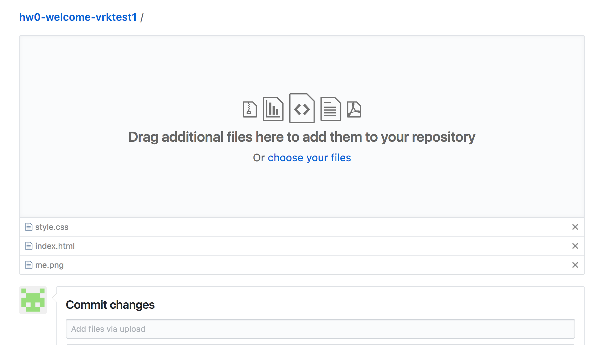

Welcome to CS193X! This assignment is designed to help you get set up with your development environment and with our homework turn-in system. It also gives us a chance to get to know you a little better, too!

This is not intended to take a very long time to complete, but please get started sooner rather than later so we can fix any issues before the first real homework assignment.

* TOC
{:toc}

<section class="part" markdown="1">

## Part 1: Getting started with GitHub
We will be using GitHub Classroom for homework distribution and turn-in. This will lead you getting started with GitHub and Git.

**If you are familiar with GitHub, skip to Part 2.**

### 0. What is Git and GitHub?
{:.no_toc}

- **Git** is a [version control system](https://www.atlassian.com/git/tutorials/what-is-version-control), which is a program that developers use to track and manage changes to source code over time.
- GitHub is a company that provides hosting for code that is managed by the Git version control system.

Git and GitHub are sophisticated tools for collaborative software development, used by millions of software developers worldwide. Git is incredibly powerful, but it has a somewhat notoriously steep learning curve.

Luckily for CS193X, we will only be using a very small subset of Git and GitHub's features.

### 1.  Sign up for a free [Github account](https://github.com/)
{:.no_toc}
_Skip this if you already have a GitHub account._
- You will need a GitHub account to use GitHub Classroom.
- Sign up for one if you don't have one already.

### 2. Get the [GitHub Education Pack](https://education.github.com/pack)
{:.no_toc}

_Optional: This is useful in general, but not needed or beneficial for CS193X._

- This is not necessary for CS193X, but GitHub offers a bunch of free services for students, including free unlimited private GitHub repositories.
- Learn more and sign up via the [Student Developer Pack](https://education.github.com/pack).

</section>

<section class="part" markdown="1">
## Part 2: Get the HW0 code

In CS193X, we will be using GitHub for the following purposes:
1. You will download the homework starter code from GitHub.
2. You will upload your homework solution code to GitHub.
3. You will publish your web page(s) to the internet via GitHub Pages.

### 1. Accept the HW0 assignment
{:.no_toc}

- [Follow this link](https://classroom.github.com/assignment-invitations/13dc240372627c7d0cf1f6c8739ee539), where HW0 is stored on GitHub Classroom.
- Click the green "Accept this assignment" button.

- Follow the link to your newly created assignment on the next screen.

### 2. Download the HW0 starter code
{:.no_toc}

Technically, your newly created assignment is a "GitHub repository."
- This is a private repository, meaning only you (and the course staff) can view website created at this link.
- This is basically a private online folder where you will ultimately store your finished homework files. Right now, though, it contains the starter code for the assignment.

At this point, you want to download the files in this repository.

> ### Git-speak for people who are very familiar with Git already:
> {:.no_toc}
>
> _(Please **ignore this box entirely** if you've never used git before.)_
> - The "assignment" created for you through the GitHub Classroom UI is a private GitHub repository like any other private GitHub repo you would own.
> - You can **clone**, **push**, and **pull** to this repository using the command-line or whatever UI you prefer.
> - If you want to use git to manage your assignment (as opposed to the GitHub web UI), just **clone** your assignment repository and skip to Part 3.

To download the starter code via the GitHub UI:
- In your homework repository (i.e. <a href="your-github-repo.png">this screen</a>), click the green "Clone or download" button.

- In the menu that pops up, click "Download ZIP"

### 3. View the starter code in a browser
{:.no_toc}

Note that **Chrome** is the recommended browser for the course, and your TAs will be grading your assignments using the Chrome browser. Please either [install and use Chrome](https://www.google.com/chrome) for development, or at least make sure to test your assignments in Chrome before submitting them.

- Unzip your downloaded zip file somewhere on your computer
- Open "index.html" in Chrome or another browser of your choosing.
- You should see something that looks like the following:

</section>

<section class="part" markdown="1">

## Part 3: Edit the HW0 code

### 1. Download and install Atom
{:.no_toc}

_Optional: We will be using Atom in lecture, but you may use whatever text editor you'd like._

We recommend that you use the [Atom text editor](https://atom.io/) for CS193X.
- [Download and install Atom](https://atom.io/)

Unlike CS106A and 106B, though, it is not very important for you to use Atom if you prefer a different text editor for CS193X. However, the course staff will not provide support for any other editor besides Atom.

### 2. Fix the TODOs in `index.html`
{:.no_toc}

- In Atom (or your preferred text editor), open `index.html` and fix the TODOs.
- Here is a screenshot of an example "solution":

</section>

<section class="part" markdown="1">

## Part 4: Upload to GitHub

Now that you've completed the homework, you should upload your files back to your Homework 0 repository.

> ### Git-speak for people who are very familiar with Git already:
> {:.no_toc}
>
> _(Please **ignore this box entirely** if you've never used git before.)_
> - If you cloned your repository via git, just commit all changes and push them to the repository on GitHub.
> - You can now skip to Part 5.

- Navigate to your `hw0-welcome-`(username) repository on GitHub (i.e. <a href="your-github-repo.png">this screen</a>).
- Click the "Upload files" button.

- On the next screen, select your `index.html`, `style.css`, and your image file for upload. Your screen should now look like the following:

  - (You actually don't have to upload `style.css` again since you didn't modify it.)
- Scroll to the bottom of the screen and click the green "Commit changes" button. You don't need to fill out any of the form.

</section>

<section class="part" markdown="1">

## Part 5: Publish your GitHub Page

</section>

<section class="part" markdown="1">
## Part 6: Submit

Finally, you can submit your assignment

</section>
