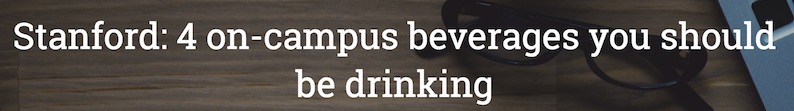
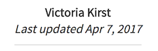
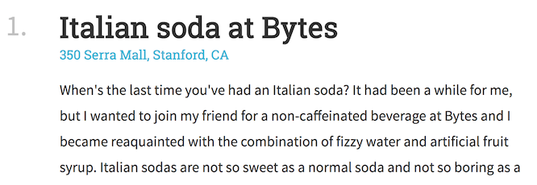
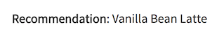


../

In this homework, you will be practicing the HTML and CSS that we learned in lecture.  

For **Part 1**, you are given screenshots and a description of a specific web page to replicate. You will recreate the web page exactly as shown in the provided screenshots.  

For **Part 2**, you will create your own list-based article with any styling you'd like.

Due Date: Mon, Apr 17, 2017 at 11:59pm _(late cutoff: Wed, Apr 19, 2017 at 11:59pm)_  
HW1 Mini: [Mini-Homework #1](https://goo.gl/forms/h2bwjcItyCCdMXS12)  
HW1 Turn-in: [Submission Form](https://goo.gl/forms/lK8Me9DqLTWtEOZA3)

---

* TOC
{:toc}

<section class="part" markdown="1">
## Part 0: Getting started

### 1. Mini-Homework
{:.no_toc}

- [Complete the Mini-Homework](https://goo.gl/forms/h2bwjcItyCCdMXS12) to review some of the concepts needed to complete this homework.

### 2. Accept the HW1 assignment
{:.no_toc}

- [Follow this link](https://classroom.github.com/assignment-invitations/7267dc1a9dd07336dad75191c11919f5), where HW1 is stored on GitHub Classroom.
- Accept the homework and download the starter code as you did in [Homework 0]({{relative}}/homework/hw0-welcome).

</section>

<section class="part" markdown="1">
## Part 1: Beverage Listicle: `listicle.html`

A [listicle](https://en.wikipedia.org/wiki/Listicle) is a somewhat trendy type of article that uses a list as its thematic structure.

For Part 1, you will create a listicle web page that describes the "4 on-campus beverages you should be drinking" at Stanford. You should create the web page in `listicle.html` with styles defined in `listicle-style.css`.

### 1. Overall appearance
{:.no_toc}

Here is a miniature screenshot of the website you need recreate in this homework:

  

A full-size screenshot of the entire page (with a screen width of 1280px) is linked below:
- [Full-size screenshot](images/hw1-fullpage.png)

**Note that you do not have to type in the contents of the page.**
- The text of the article is contained within `listicle-content.txt`, which is included in your Homework 1 starter code.
- Copy and paste the text of `listicle-content.txt` into your `listicle.html` file, then add the HTML tags necessary to style the page.
- The images are also in the `images/` directory of the Homework 1 starter code.

### 2. Section measurements
{:.no_toc}

### 3. Font faces, sizes, and colors
{:.no_toc}

**Page Title:**

- The font face is `'Roboto Slab'` and the fallback font is `serif`.
- The font size is `36px`.
- The font weight is `normal` (not bold).
- The font color is `white`.
- The title is vertical and center aligned to the header image.

**Profile Text:**

- The font face is `'Source Sans Pro'` and the fallback font is `sans-serif`.
- The font size is `18px`.
- The font weight for the author name ("Victoria Kirst") is `bold`
- The font style for the last updated ("Last updated Apr 7, 2017") is `italic`.
- The font color is `rgb(51, 51, 51)`.
- The line height `24px`.
- The gray line under the "Last updated" line is `10px` under the text, `2px` wide, and the color is `#e6e6e6`.

**Body Text:**

- Heading
  - The font face is `'Roboto Slab'` and the fallback font is `serif`.
  - The font size is `36px`.
  - The font weight is `bold`.
  - The number's color is `rgba(0, 0, 0, 0.25)`.
  - The title color is `rgb(51, 51, 51)`.
- Address
  - The address under the heading is a link and is described in the [Links section](#links).
- Paragraphs
  - The font face is `'Source Sans Pro'` and the fallback font is `sans-serif`.
  - The font size is `18px`.
  - The line height `32px`.
  - The font color is `rgb(51, 51, 51)`.

- Recommendation
  - The phrase "Recommendation:" is `bold`.

### 4. Links
{:.no_toc}

Here is a description of how links should work on your page:

- Each address of the page is a link. The URL for each link is listed in `listicle-content.txt`.
- The link color is `#42b4d6`.
- The link is not bold, and the link is not underlined unless you hover over the link.
- When you hover over the link, the link becomes underlined.
- Hints:
  - To remove an underline, you can use CSS property `text-decoration: none;`
  - To add an underline, you can use CSS property `text-decoration: underline;`

### 5. Images
{:.no_toc}

- Header image
  - The header is a background image (`images/header.jpg`).
  - The background does not repeat.
  - The background's size is set to `cover`.
  - The background position is anchored to the `top`.
  - Its height is `500px`.
  - There is a semi-transparent color overlay on top of the header image, which is `rgba(0, 0, 0, .3)`   
    - **Note:** You can achieve this using the following CSS rule:  
      `background: linear-gradient(rgba(0, 0, 0, .3), rgba(0, 0, 0, .3)), url(./images/header.jpg);`
- Profile image
  - The profile image is `images/vrk.png`
  - Its width is `100px`.
  - It has rounded corners with radius `100%`.
  - It has a `white` border that is `1px` thick.

---

## HTML and CSS style requirements
{:.no_toc}

For full credit, please abide by the following:

- **Use HTML and CSS we've learned in class.** You should be able to complete this homework using HTML and CSS we've  learned in class through lecture 5 / Apr 12. While you are not strictly forbidden from using HTML/CSS we haven't talked about in class, if you use it incorrectly or if you make poor stylistic choices.
- **Do not use JavaScript**. There's no need to use JavaScript in this assignment.
- **Respect Separation of Concerns**. Your HTML should describe the content of your page, and your CSS should describe your page's appearance.
- **Do not use an ordered list element (`ol`) to create the list layout.** There's nothing wrong with doing this, per se, but it involves some fairly esoteric CSS that we did not cover in class. We recommend you write out the numbers "1.", "2.", etc. in the HTML instead of using `ol`.
- **Follow the best practices** that were described in lecture and in the mini-homework.
- **Reduce redundancy in CSS.** Try not to have too many redundant styles, if there are ways to use inheritance or special selectors to concisely define style rules.
- **Match the given appearance as closely as possible.** It's fine if your web page is off from our description by a few pixels here and there, but noticeable differences may result in a lower homework score.
- **Use descriptive names, consistent spacing,** and otherwise follow good code hygiene.

</section>

<section class="part" markdown="1">
## Part 2: Your Listicle: `my-list.html`

Design your own listicle! You should write the content in `my-list.html` and the style in `my-list-style.css`.

For full credit, please abide by the following:
- Cannot be a copy of `listicle.html`
- Must have at least 3 items in your list
- Must correctly use `display: flex` at least once.
- You can, but do not have to, refer to `listicle-style.css`.

</section>

<section class="part" markdown="1">

## Submit

Upload your completed homework to your GitHub repository and publish them, in the same way that you did with [Homework 0]({{relative}}/homework/hw0-welcome).

Turn in the link to your GitHub repository and links to your two completed web pages via this form:
- [Turn in Homework 1](https://goo.gl/forms/lK8Me9DqLTWtEOZA3)

</section>
