
../

In this homework, you will be practicing the HTML, CSS, and JavaScript that we learned in lecture.

For **Part 1**, you are given screenshots and a description of a specific web page to replicate. You will recreate the web page exactly as shown in the provided screenshots.  

For **Part 2**, you will finish two partially-implemented Chrome extensions. Unsurprisingly, you will need to use [Chrome](google.com/chrome) for this part of the assignment.

Due Date: Wed, Apr 26, 2017 at 11:59pm _(late cutoff: Fri, Apr 28, 2017 at 11:59pm)_  
HW2 Mini: [Mini-Homework #2]()  
HW2 Turn-in: [Submission Form]()

---

* TOC
{:toc}

<section class="part" markdown="1">
## Part 0: Getting started

### 1. Mini-Homework
{:.no_toc}

- [Complete the Mini-Homework]() to review some of the concepts needed to complete this homework.

### 2. Accept the HW2 assignment
{:.no_toc}

- [Follow this link](), where HW2 is stored on GitHub Classroom.
- Accept the homework and download the starter code as you did in [Homework 0]({{relative}}homework/hw0-welcome).

</section>

<section class="part" markdown="1">
## Part 1: Personality quiz `index.html`

For Part 1, you will create a personality quiz called "Pick A Dog And We'll Reveal A Deep Truth About You." You should create the web page in `index.html`, define the styles in `style.css`, and define the behavior in `script.js`.

In this homework, you will need to implement the mobile layout as well as the desktop layout. Our intention is that it would take only minor modifications to your HTML and CSS to make it display correctly on mobile.

### 1. Overall appearance

Here is a miniature screenshot of the website you need recreate in this homework.

Click the screenshot below to toggle "answered" and "unanswered" view.

  

Full-size screenshots of the entire page (with a screen width of 1280px):
- [Full-size screenshot: Unanswered](images/hw2-screenshot-unanswered.png)
- [Full-size screenshot: Answered](images/hw2-screenshot-answered.png)

You need to also create a mobile layout for the quiz. You should *not* have to drastically change your HTML and CSS to support both the desktop and mobile layouts.

Click the screenshot below to toggle "answered" and "unanswered" view.

  

Full-size screenshots of the mobile view (iPhone 6 size: 375 x 667):
- [Full-size screenshot: Unanswered mobile](images/hw2-screenshot-unanswered-mobile.png)
- [Full-size screenshot: Answered mobile](images/hw2-screenshot-answered-mobile.png)

### 2. Behavior

This web page is a 1-question personality quiz. Write the HTML, CSS, and JavaScript necessary to implement the quiz as detailed below.

**Clicking a quiz result**

When the user clicks a dog, the personality results should appear at the bottom of the page, with the personality data that corresponds to the dog, as defined by `constants.js`.

- The checkbox image should change from unchecked to checked
- The style of the selected dog and the other non-selected dogs should update according to the appearance description in the "Appearance details" part of the spec.
- See "Appearance details" below for:  
  - How you should display the personality result.
  - How you should display the selected dog after it is clicked.
  - How you should display the non-selected dogs after the selected dog is clicked.

**After selecting a dog**

After the user clicks a dog once, the quiz is complete.

- It should not be possible to select another dog after you've completed the quiz.
  - i.e. you click another dog after the quiz is complete, nothing on the page should change.
- The page should remain in this "completed" state until the user refreshes the page or clicks "Restart quiz".

**Resetting the quiz**

If the user clicks the "Restart page" button, the page should reset to its original state.

- The dogs should return to their original appearance before the quiz was complete
- The personality results should disappear
- The dogs should be selectable again, and clicking on a different dog should result in showing another personality type.
- It should look the same as if you had refreshed the page (but you should not actually refresh the page)

**`constants.js`**
- This file contains the definition of the object `RESULT_MAP`, which maps the dog type to its result title and description.
- Because this variable is declared in the global scope, you can access this variable in `script.js`.
- You should **not** have to modify this file to solve the homework.

**`script.js`**
- This is the file in which we expect you to implement the quiz behavior.
- You should define and attach event listeners in this file.

**Image to personality mapping**

The `RESULT_MAP` is defined in `constants.js` and the images are saved in the `images/` directory.

- `blepdog.jpg` corresponds to `blep` in `RESULT_MAP`
- `happydog.jpg` corresponds to `happy` in `RESULT_MAP`
- `sleepingdog.jpg` corresponds to `sleeping` in `RESULT_MAP`
- `dopeydog.jpg` corresponds to `dopey` in `RESULT_MAP`
- `burgerdog.jpg` corresponds to `burger` in `RESULT_MAP`
- `cartdog.jpg` corresponds to `cart` in `RESULT_MAP`
- `nerddog.jpg` corresponds to `nerd` in `RESULT_MAP`
- `shydog.jpg` corresponds to `shy` in `RESULT_MAP`
- `sleepydog.jpg` corresponds to `sleepy` in `RESULT_MAP`

### 3. Appearance details

**Overall appearance**
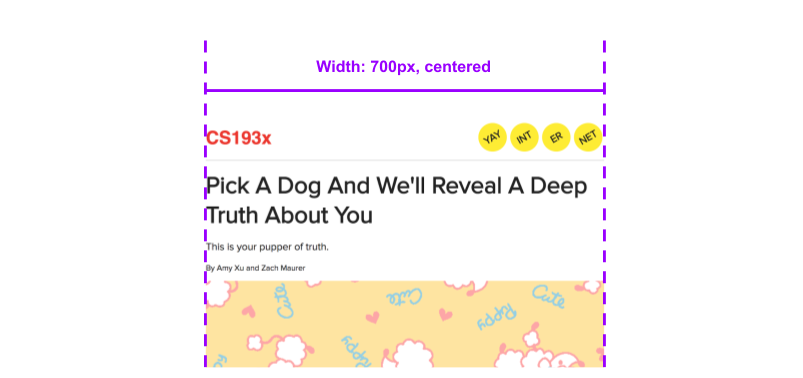

- The content of the page should be set to 700px wide and centered.
- Page font is `'Proxima Nova'`, with backup font `sans-serif`, unless specified otherwise below.
- Font color for the page is `#222222`, unless specified otherwise below.

**Page header**

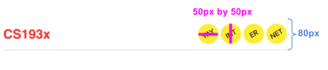

- Header container
  - Height of the header is `80px`
  - Bottom border is `1px` thick and `#cccccc` in color
  - Content in the header is vertically centered
  - **Hint:** The layout of this header is quite similar to the header of the [Squarespace example](http://www.stanford.edu/class/cs193x/lectures/06/squarespace-mobile.html).
- CS193x
  - Color is `#ee3322`
  - Font is `'Helvetica'` with `'Arial'` and `sans-serif` as backups.
  - Font size is `32px`
  - Font weight is `bold`
- Yellow circles
  - Background color is `#ffee00`
  - Height and width are `50px`.
  - Space between the circles is `6px`
  - You can make a circle effect by setting the `border-radius` to `100%`.
  - You can rotate the circle by using CSS property `transform: rotate(-30deg);`

**Title**
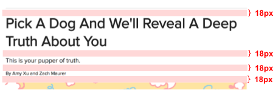

- There's `18px` of space between each element
- Pick A Dog...
  - Font size is `42px`
  - Font weight is bold
- This is your...
  - Font size is `18px`
- By Amy Xu and Zach Maurer
  - Font size is `14px`

**Quiz header**
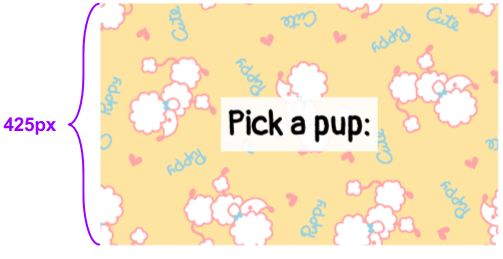

- Container
  - Height is `425px`
  - Width is `100%` of the parent element's width
  - Background image is `images/background.gif`
- Pick a pup
  - Font is `'Pangolin'` with fallback fonts `'Trebuchet MS'` and `cursive`
  - Font size is `60px`
  - Semi-transparent white rectangle behind the text is `rgba(255,255,255, 0.9);`
    - The white rectangle extends `10px` from each side of the text.

**Dog grid**

- You should use a **multi-row flexbox** to achieve this layout.
  - We didn't talk about multi-row flexbox layout in class, but you can allow flex items to wrap onto the next line (i.e. the second row) by setting `flex-wrap: wrap;` onto the flex container.
- There is `20px` of space between each row
- Each flex item has a width of `32.5%`, and each item is spread out with as much space between the other as there can be in the flex container.

**Dog choice: unanswered**
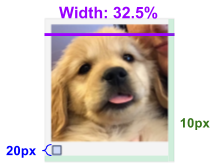
- Container
  - Background color is `#f4f4f4`
  - Border is `1px` thick and color is `#dcdcdc`
  - Width of the element **including** the border is `32.5%`
    - **Hint:** The `box-sizing` CSS property might be helpful. See April 12 slides.
  - Space between the border and the content of the element is `10px`.
- Checkbox
  - The unchecked image is `images/unchecked.png`
  - The height and width is of the image is `20px`
  - **Note:** Do not use an `<input type="checkbox" />` for this. Just display the image.

**Dog choice: answered**
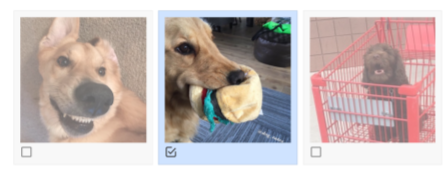
- Chosen dog
  - Background color is `#cfe3ff`
  - The checked image is `images/checked.png`
- Other dogs
  - Make the item semi-transparent by setting `opacity: 0.6;`

**Quiz result**
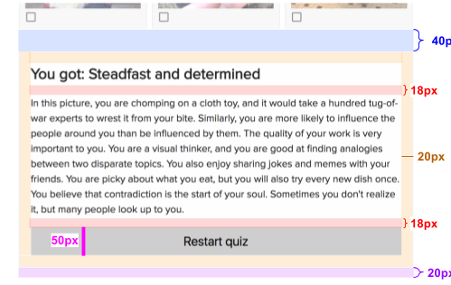
- Result button
  - Background color is `#cecece`
  - On hover, the color should change to `#e0e0e0`
    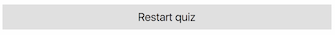

### 4. Mobile appearance details

Please see April 14 Slides for details on how to implement and test your homework layout in mobile view on your desktop Chrome.

**Note:** You should **not** have to load your web page on your phone in order to test this layout. Emulate mobile in [Chrome](https://developers.google.com/web/tools/chrome-devtools/device-mode/), [FireFox](https://developer.mozilla.org/en-US/docs/Tools/Responsive_Design_Mode), or [Safari](http://www.kirkville.com/use-safaris-responsive-design-mode-in-el-capitan/)

- If the page is viewed on mobile:
  - The viewport should be set to zoom-level 100%, and the width should be the device width
- If the device screen size is less than `700px` wide:
  - The width of the page content should be `95%` instead of `700px`
  - The yellow circles in the page header should not appear
  - Each dog choice should be `49%` in width instead of `32.5%`

</section>

<section class="part" markdown="1">
## Part 2: Evil extension

The next two parts of the assignment involve writing Chrome extensions.

The first extension is called "Evil extension." When you install it, all instances of "there", "their", and "they're" on the page are changed to the wrong spelling in the following way:
- "there" changes to "their"
- "their" changes to "there"
- "they're" also changes to "there"

This mapping (along with a few case-related variations) is stored in the `MATCH_LIST` object at the top of the file. Use this mapping to complete the extension.

### 1. Install Chrome
{:.no_toc}

This is the only assignment in the quarter where you **must** use Chrome. Please [download and install Chrome](https://www.google.com/chrome/) if you haven't already.

### 2. Install the Evil Extension
{:.no_toc}

The HW2 starter code comes with the starter code for the Evil Extension.

**Open chrome://extensions**

In the URL bar, type in `chrome://extensions` and hit enter. This will bring you to Chrome's extensions settings page.

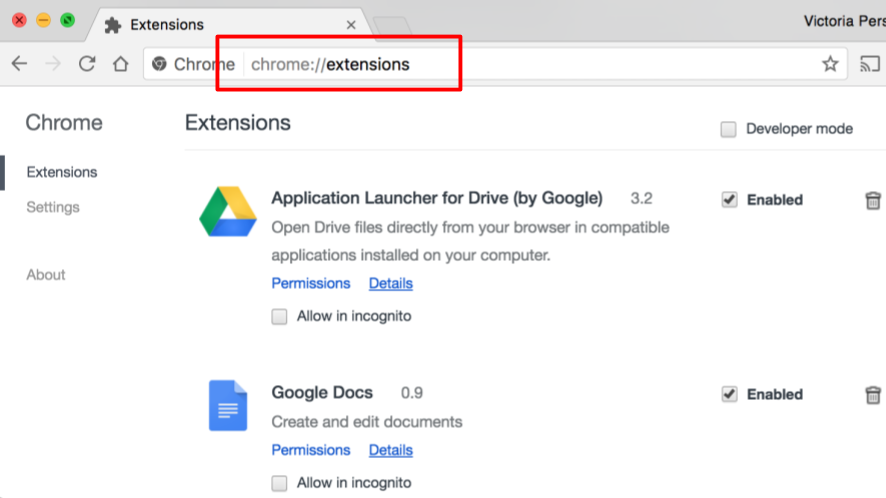

**Check "Developer mode"**

In the upper right corner, there is a check box that says "Developer mode." Check this box.

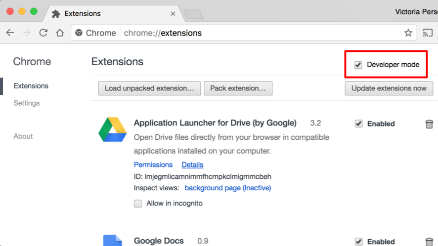

**Click "Load unpacked extension"**

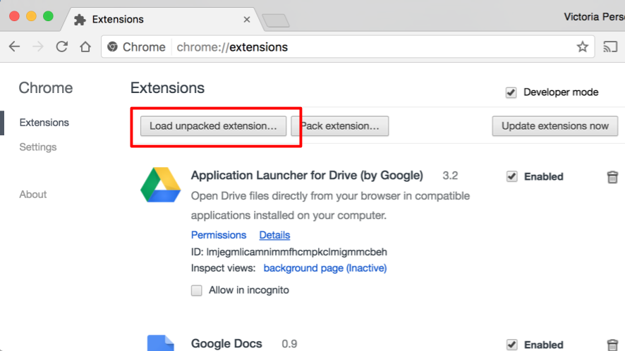

**Navigate to the "evil-ext" directory"**

In the file chooser window that pops up, you should navigate to the `evil-ext` directory included in the starter code.

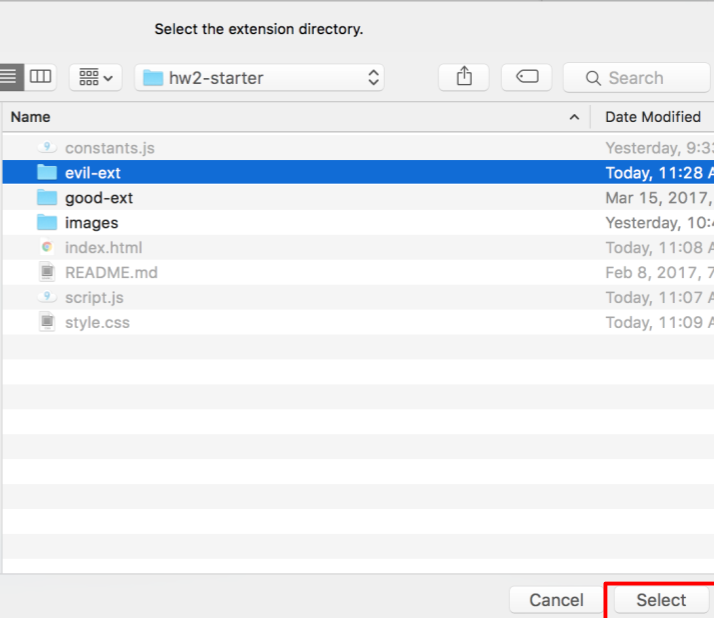

You should now see the Evil Extension in the list of extensions.

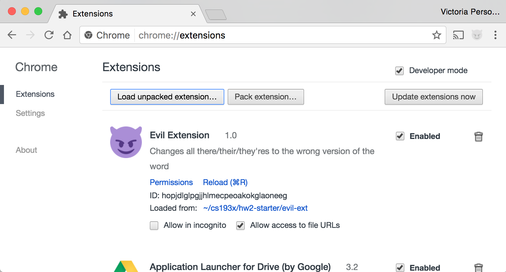

### 3. Verify Evil Extension is loaded
{:.no_toc}

The Evil Extension contains a print statement in `page.js`. Because this is a Chrome extension, this print statement will not show up in the usual Web Console. The following steps will show you how to view this print statement.

**Navigate to a test file**

You can actually do this from any page, but we're using a test file for simplicity.

Open the following link in a new tab:
- [simple-test.html](hw2/simple-test.html)

**Open the Web Console**

On the [simple-test](hw2/simple-test.html) page, open the Web Console. You should see the debug print statement:

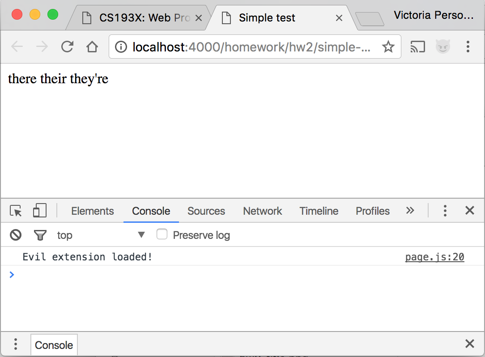

**Make a change to `script.js`**

Every time you make a change to the extension, you will need to refresh the `chrome://extensions` page.

Try making a change and verify it shows up in the console:
- Add a second `console.log` statement at the bottom of `script.js`, such as `console.log('Extension updated');`
- Navigate to chrome://extensions in a new tab, and either click "Reload" or press command-R (ctrl-R on Windows)
- Navigate to [simple-test.html](hw2/simple-test.html) and view the Web Console.

You should see your second print statement in the Web Console:

**Debugging the script**

You will probably want to debug your extension's JavaScript using the [Chrome Debugger](https://developers.google.com/web/tools/chrome-devtools/javascript/reference). You can find the JavaScript files from this extension by navigating to:
- Sources -> Content Scripts -> Top -> Evil Extension -> page.js

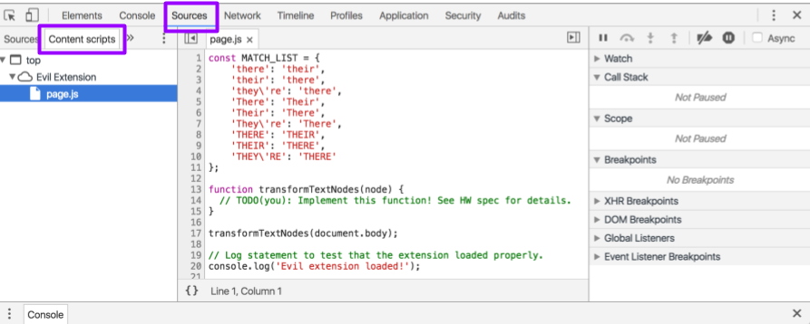

You can then set breakpoints in this view.

### 4. Implement `transformTextNodes`
{:.no_toc}

The `transformTextNodes` function should recursively walk the DOM tree and modify the `textContents` of each text node that contains a "there", "their", or "they're" as necessary:
- "there" changes to "their"
- "their" changes to "there"
- "they're" also changes to "there"

These rules (along with a few case shifts) are contained by `MATCH_LIST`.

The `transformTextNodes` function takes a DOM node reference as a parameter. At the bottom of `page.js`, there's an initial call to the function: `transformTextNodes(document.body)`. You should not have to change this function call.

**Note:** You may not use the `TreeWalker` JavaScript API to solve this, only because we want you to get a deeper understanding of the DOM through walking the tree manually. However, if you were implementing something like this outside of 193X, you should use `TreeWalker` instead of manually walking the tree.

**TODO(vrk):** Add more hints for this.

### 5. Evil Extension test files
{:.no_toc}

You should verify your Evil Extension works on the following files:
- [simple-test.html](hw2/simple-test.html)
- [NYT article](https://www.nytimes.com/2017/04/18/dining/halal-cart-food-vendor-new-york-city.html)
- TODO(vrk): Add more test files

**Your extension does NOT have to work on files other than the ones listed.**
- One example in particular: Your extension will NOT work on CodePen links. This is because CodePen loads code dynamically in an `iframe`, which means content scripts cannot run in the output windows of CodePen.

</section>

<section class="part" markdown="1">
## Part 3: Twitter gardener

</section>

<section class="part" markdown="1">

## Submit

Upload your completed homework to your GitHub repository and publish them, in the same way that you did with [Homework 0]({{relative}}homework/hw0-welcome).

Turn in the link to your GitHub repository and links to your two completed web pages via this form:
- [Turn in Homework 2]()

</section>
