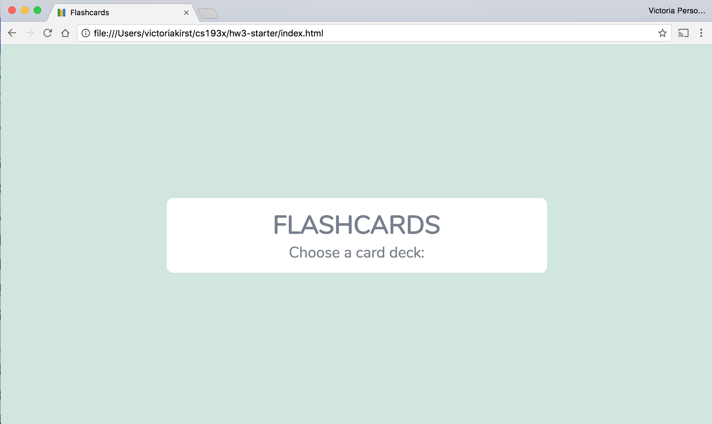
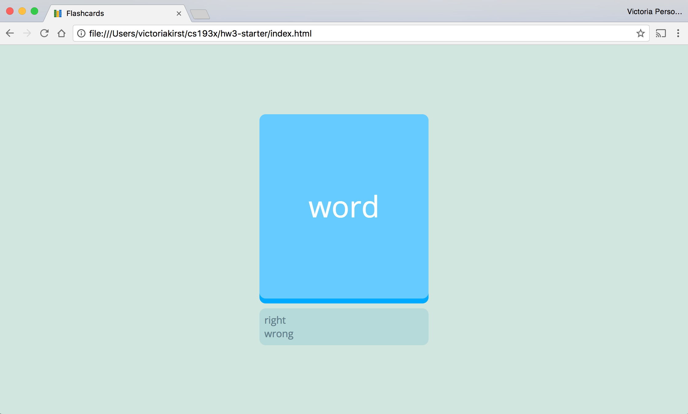
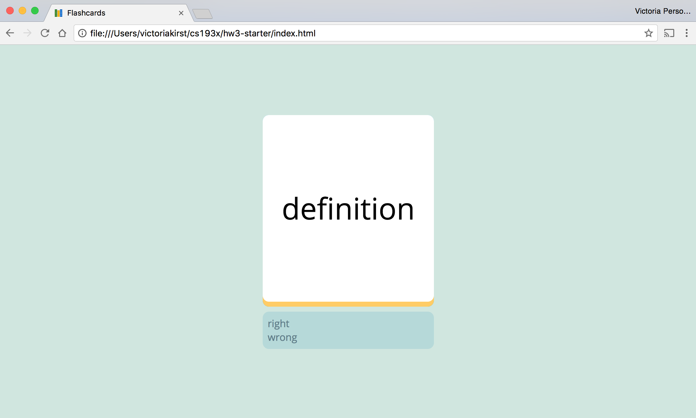
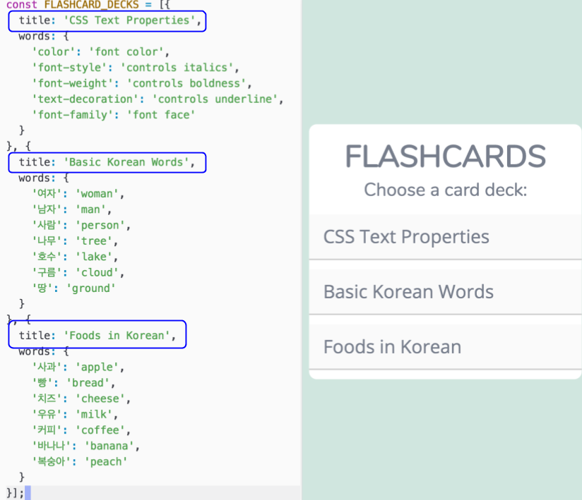
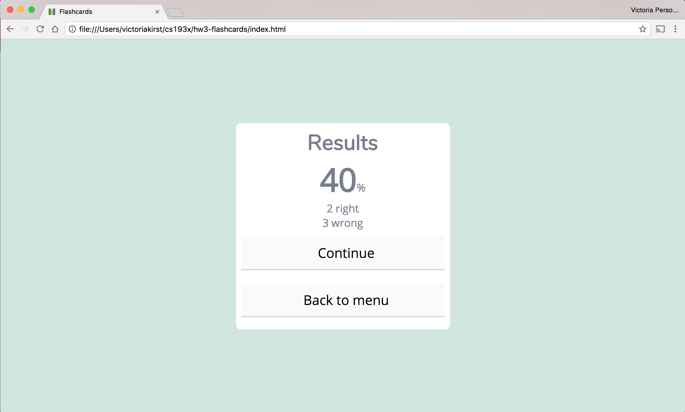
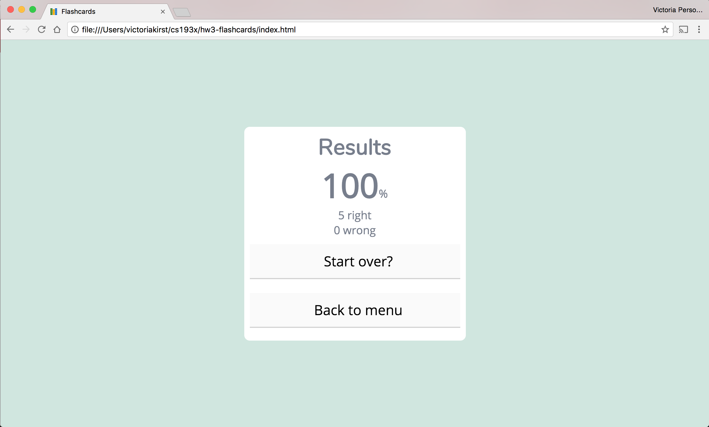


../

In this homework, you will be creating a Flashcard web app that loads desks of flashcards for the user to review and score themselves. You will be practicing Object-oriented JavaScript, Mobile JavaScript and Animations.

We are providing several stub JavaScript classes to help you finish this assignment. We are **not** telling you what methods / fields / etc you need to add to your classes; that is for you to decide.

Note that we will _not_ grade on having good OO design; you just need to get the app working without using global variables.

<span class="label">Due Date:</span> Fri, May 5, 2017 at 11:59pm _(late cutoff: Sun, May 7, 2017 at 11:59pm)_  
<span class="label">HW3 Turn-in:</span> [Submission Form](https://goo.gl/forms/mijI69Hxz3Fh2NQY2)  

---

* TOC
{:toc}

<section class="part" markdown="1">
## 1. Getting started

### 1. Accept the HW3 assignment
{:.no_toc}

- [Follow this link](https://classroom.github.com/assignment-invitations/2c281cf02c0dc163e54706ffa56f22b5), where HW3 is stored on GitHub Classroom.
- Accept the homework and download the starter code as you did in [Homework 0]({{relative}}homework/0-welcome).

### 2. Overall behavior
{:.no_toc}

You will be implementing a simple Flashcard web app that loads flashcard desks defined in `constants.js`.

- The user clicks or taps the flashcard to toggle between the word and definition.
- If the user got the flashcard **correct**:
  - The user drags and releases it to the **right side** of the screen.
- If the user got the flashcard **wrong**:
  - The user drags and releases it to the **left side** of the screen.

Watch the videos below to see the behavior of a completed Flashcard app in desktop and mobile views:

**Desktop:**
<iframe src="https://drive.google.com/file/d/0BxtKIz3gISundnpsMnZ1RWJ5Ums/preview" width="640" height="360"></iframe>

**Mobile:**
<iframe src="https://drive.google.com/file/d/0BxtKIz3gISunakpvbE8xTmllU00/preview" width="640" height="360"></iframe>

</section>

<section class="part" markdown="1">
## 2. Understanding the starter code

We have provided several starter code files to help you write this flashcard app. This section provides more information about the starter code and how to get started with it.

**You will need to understand and modify all of the JavaScript starter files that we give you to complete this assignment.**

We have also provided almost all of the CSS of this app. Unlike the JavaScript files, you should not have to modify `style.css`. The only CSS you should be adding is for animations and dragging effects, which you can add in `flashcard-style.css`.

### 1. Starter code description
{:.no_toc}

Below is a brief description of all the files provided via starter code:

- `main.js`: This is the script that starts off your app. It begins by creating an `App` object.
- `app.js`: The `App` object encapsulates the entire state of the application. It creates three objects representing the three "screens" of the app:
  - `menu-screen.js`: The `MenuScreen` object represents the menu screen of the application. From here, you can choose a flashcard deck to review.
  - `flashcard-screen.js`: The `FlashcardScreen` represents the main screen of the application, where you see and answer the flashcards from the deck you've selected.
    - `flashcard.js`: The `Flashcard` object represents one flashcard. You can click on it to flip between the front and the back of the card.
  - `results-screen.js`: The `ResultsScreen` object represents the results screen that appears after you've finished a flashcard deck. It gives you the options to continue with the cards you've gotten wrong or to go back to the menu.
- `constants.js`: This includes the `FLASHCARD_DECKS` global variable, which is an array of objects that represent a single flashcard deck. **We aren't expecting you to need to modify this file**.

**Note:** We generally expect you to use and modify the provided classes to complete the assignment. However, if you feel strongly that you want to complete the assignment in a different way, e.g. you don't want to use the `MenuScreen` object for some reason, you are free to delete any of the given starter code in favor of a class structure of your choosing.

- `index.html`: Contains the HTML markup for all 3 screens of the flashcard app, contained in the following `div`s: `#menu`, `#main`, and `#results`. **We aren't expecting you to need to modify this file**, though you can if you'd like.

- `style.css`: Contains the style rules for all screens and the flashcards. **We aren't expecting you to need to modify this file**.
- `flashcard-style.css`: An empty CSS file for you to add any additional CSS rules you need to complete the assignment. You should only need to add CSS for animations and dragging effects.


### 2. Toggle between the screens
{:.no_toc}

Every screen object contains a `show()` and a `hide()` method. Complete the following steps to see what we've provided.

**Menu screen**
- Open `index.html` in a browser. It should look like the following:


As you can see, the menu screen is not complete. You will need to write the JavaScript necessary to implement the menu as explained the later sections.

**Main/Flashcard screen**
- In `app.js`, uncomment lines 21 and 22:
```
this.menu.hide();
this.flashcards.show();
```
- Refresh `index.html. It should look like the following:

- Click on the card a couple times. This should make it flip from front to back:

- Open `flashcard-screen.js`. Notice that the flashcard appears with "word" and "definition" because of the following line:
```
const card = new Flashcard(flashcardContainer, 'word', 'definition');
```
  - This line of code was only included so that you can see the `Flashcard` implementation we've provided so far. Of course, you should modify or delete this line of code to complete the app.

The flashcard screen is not complete, either. You will need to write the JavaScript necessary to implement the flashcard behavior as explained its dedicated section of the spec.

**Results screen**
- In `app.js`, re-comment or delete lines 21 and 22 now:
```
// this.menu.hide();
// this.flashcards.show();
```
- Uncomment lines 25 and 26:
```
this.menu.hide();
this.results.show();
```
- Refresh `index.html`. It should look like the following:


You will have to write the JavaScript necessary to fill out the results screen and implement its behavior, as explained later in the spec.

</section>


<section class="part" markdown="1">
## 3. Implementation: Menu screen

This section describes the details on how the Menu screen should be implemented.



**Behavior**
- The flashcard menu items are taken from the `title`s in `constants.js`.
- The menu items should appear in the order they appear in the `FLASHCARD_DECKS` array
- When you click on a menu item, the menu screen should become hidden and the user should be taken to the Flashcard screen, loaded with the `words` deck associated with the selected menu item.
- The menu should work even if you changed the values of `FLASHCARD_DECKS` (while keeping the same general data format). For example, your menu should **not** be hardcoded to work for only three menu items.

**Style**
- All `<div>` elements appended to the `<div id="choices"></div>` will receive the correct style as defined by the provided stylesheet.
- Therefore you should create each menu item using a simple `<div>` element with the title as its text content, and you should append these `<div>` elements to the `<div id="choices"></div>` container.

</section>

<section class="part" markdown="1">
## 4. Implementation: Flashcard screen and flashcard behavior

This section describes the details on how the Flashcard / Main screen should be implemented, and the behavior of the flashcards themselves.

### Initial animation
{:.no_toc}

When a new card is shown, it animates in from the bottom.

<video src="videos/hw3-animation.mp4" controls autoplay loop></video>
- The animation should take around `0.5s`.
- **HINTS:**
  - You should use the `@keyframes` CSS animation styles we learned in class
  - You should apply the animation to `.flashcard-box .word`

### Click flashcard
{:.no_toc}
This behavior is already implemented for you, but you may have to modify your code to keep this functionality working after you implement the drag behavior.

<video src="videos/hw3-click.mp4" controls autoplay loop></video>

- When you click a card, it should toggle between showing the word and the definition.
  - This is **already implemented** for you.

### Drag flashcard
{:.no_toc}

There are several aspects to dragging, broken down below.

Here are a few terms we will be using:
- **origin**: The initial point where the drag begins. This is the (x, y) coordinates of the mouse (specifically the `clientX` and `clientY` values) when the user first clicks down or touches down on the flashcard to begin the drag.
- **positive direction**: This indicates "positive" direction from the _origin_ as defined above, meaning e.g. (currentX - originX) > 0.
- **negative direction**: This indicates "negative" direction from the _origin_ as defined above, meaning e.g. (currentX - originX) < 0

**General drag properties**
- Dragging the flashcard should make it move along both the x- and y-axis, following the pointer as it moves around the screen.
- Dragging should only occur when the user is clicking down on desktop or touching the screen on mobile. When the user releases the click or stops touching the screen, the drag should end.
- The drag behavior is the same regardless of whether the word or definition side of the card is showing.
- **Rotate**
  - The flashcard rotates as it moves away from the origin.
  - The rotation is calculated by this formula, in degrees: **0.2 * (distanceFromOriginX)**.
  - This rotation is based distance from the origin in the x-direction only.
  - Examples:
    - If the user drags the card (100px, 30px) from the origin of the drag, then the rotation should be 0.2 * 100 = `20deg`.
    - If the user drags the card (100px, -25px) from origin: rotation is still `20deg`, since you should only calculate based on the x-value.
    - If the user drags the card (-50px, -30px) from origin: rotation is `-10deg`
- **HINT**
  - You should use the `transform` CSS property with the `translate` and `rotate` functions. See [examples](https://codepen.io/bee-arcade/pen/196d0c2483e15da3f2a888a199569fa6) and [MDN](https://developer.mozilla.org/en-US/docs/Web/CSS/transform?v=example) 

**Drag right (correct answer)**
<video src="videos/hw3-drag-right.mp4" controls autoplay loop></video>
- If the user drags the card **150px or more* in the positive x-direction, two things should happen:
  - The background color of the app changes to `#97b7b7`
  - The number in the status box counting how many you got "right" should increase by 1
- If the user drags the card back to the middle area (i.e. less than 150px from origin in the x-direction), then both of these changes should revert back:
  - The background color should go back to `#d0e6df`
  - The number in the status box counting how many you got "right" return to its original value

**Drag left (incorrect answer)**
<video src="videos/hw3-drag-left.mp4" controls autoplay loop></video>
- If the user drags the card **150px or more* in the negative x-direction, two things should happen:
  - The background color of the app changes to `#97b7b7`
  - The number in the status box counting how many you got "wrong" should increase by 1
- If the user drags the card back to the middle area (i.e. less than 150px from origin in the x-direction), then both of these changes should revert back:
  - The background color should go back to `#d0e6df`
  - The number in the status box counting how many you got "wrong" return to its original value

### Release flashcard
{:.no_toc}


**Release middle (no answer)**
<iframe src="https://drive.google.com/file/d/0BxtKIz3gISundmJ1WVJ0blA2RUk/preview" width="640" height="360"></iframe>
- If the user drags the card less than 150px in the positive or negative x-direction and releases, the card should return back to its original position.
- This transition should not be immediate: the card should move back to its original position in around `0.6s`.

**Release left or right**
<iframe src="https://drive.google.com/file/d/0BxtKIz3gISunQjdTSjRqb0dsYm8/preview" width="640" height="360"></iframe>
- If the user drags the card more than 150px in the **positive** x-direction and releases, this indicates that the user has gotten the answer **correct**:
  - The number in the status box counting how many you got "right" should increase by 1
  - The card you were dragging should immediately disappear.
  - The next card in the deck should animate into view, or the user should be shown the Result screen if it is the last card in the deck.
- If the user drags the card more than 150px in the **negative** x-direction and releases, this indicates that the user has gotten the answer **wrong**:
  - The number in the status box counting how many you got "wrong" should increase by 1
  - The card you were dragging should immediately disappear.
  - The next card in the deck should animate into view, or the user should be shown the Result screen if it is the last card in the deck.

</section>

<section class="part" markdown="1">
## 5. Implementation: Results screen

This section describes the details on how the Results screen should be implemented.

### Stats
{:.no_toc}

Display the percentage correct, the number correct, and the number incorrect for this flashcard deck.



- The `index.html` contains empty `span`s with classes `percent`, `correct`, and `incorrect`. Fill these in via JavaScript to get the desired output.
  - The stats are already styled for you via the provided CSS stylesheet so long as you fill in the correct `span` elements with the data.
- The percentage should be rounded to the nearest whole number.

### Buttons
{:.no_toc}

There are two buttons displayed at the end of the flashcard session. The first button is different depending on whether the user got every flashcard in the deck correct.

**Less than 100%**

- If the user got less than a perfect score, the first button (with a class of `continue`) should say "Continue"
- Clicking "Continue" will then go back to the Flashcard screen, but with **only the flashcards the user got wrong.**
  - The stats at the end of every round should still be out of the **total** number of flashcards in the deck. For example, if the first round you got 3/5 flashcards correct, and you continue, you will get presented with the 2 cards you got incorrect. If you get those 2 cards correct, the stats will show you've gotten "5" cards correct, since that is the total number of cards in the deck.

**Perfect score: 100%**

- If the user got a perfect score, the first button (with a class of `continue`) should say "Start over?"
- Clicking "Start over?" will then go back to the Flashcard screen with the same flashcard deck, starting over with 0 right and 0 wrong.

**Back to menu**
- Clicking the "Back to menu" button should make the app go back to the Menu screen.

</section>

<section class="part" markdown="1">

## Style requirements

**You are allowed, encouraged, and required** to make significant changes to the JavaScript files / code we've provided. You may have to do things such as:
- Add constructor parameters
- Delete lines of code we wrote in the starter code
- Add your own fields and methods to the classes

You will not be graded on OO-design skills, so do not worry too much about having perfectly composed classes.

Here are some more details on what we are looking for in terms of style:

- **No additional global variables:** For full credit, you may **not** add any additional global variables to the Flashcard app, other than the existing `app` variable defined in `main.js` and the `FLASHCARD_DECKS` in `constants.js`.
- **Use ES6 classes:** To complete this assignment, you do not need to know about other ways of creating objects, such as via `prototype`. You should practice using `class`es as described in lecture.
- **OO-design:** We are **not** going to grade on object-oriented design. We may award bonus points for particularly well-composed apps, but your main concern should be to get the functionality working.
- **Comments, variable names, etc.:** We are also **not** grading on general good coding style, such as having comments or using good variable names. However, we encourage you to practice good coding style for your TAs' sake! We will only dock style points if someone's code is so extremely difficult to read that it impedes your TA's ability to grade your assignment.

</section>

<section class="part" markdown="1">

## Submit

Upload your completed homework to your GitHub repository and publish them, in the same way that you did with [Homework 0]({{relative}}homework/0-welcome).

Turn in the link to your GitHub repository and the link to your completed flashcard web page via this form:
- [Submission Form](https://goo.gl/forms/mijI69Hxz3Fh2NQY2)

</section>
