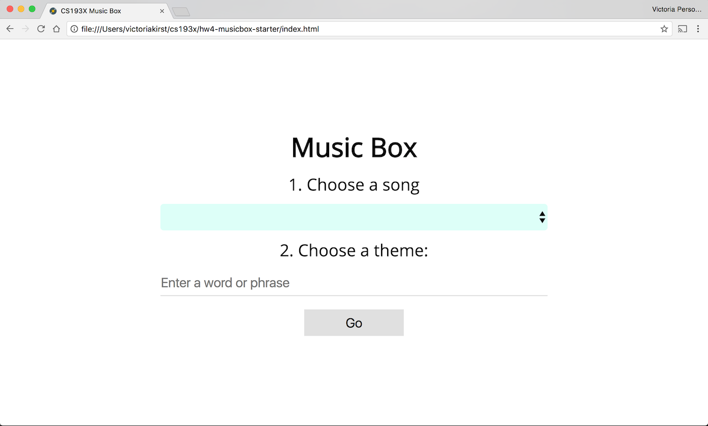
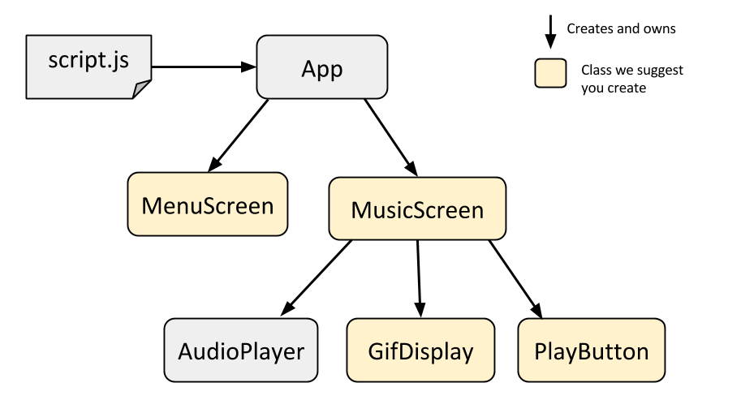
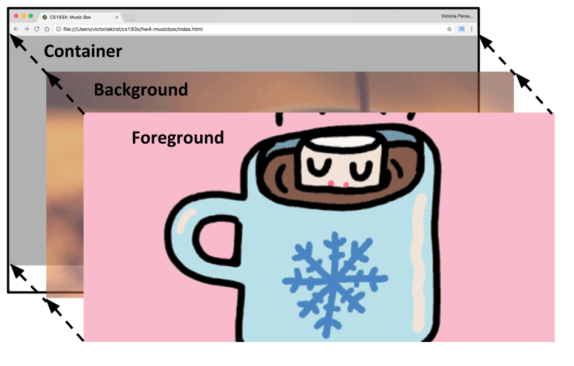
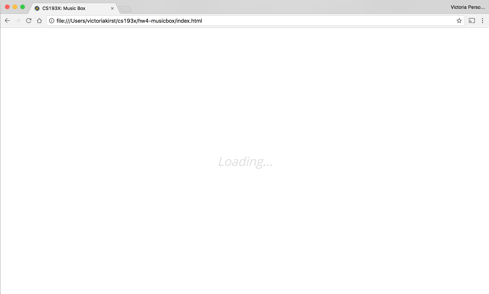


../

In this homework, you will be creating a simple music visualizer. You will be querying the [Giphy API](https://github.com/Giphy/GiphyAPI#search-endpoint) to load a different gif on each "kick" of the song.  We have provided an `AudioPlayer` class to help you implement the desired audio behavior.

This assignment gives you more practice with object-oriented (OO) web programming, and you will also practice using the `fetch` API. You will be writing most of the classes needed to create this assignment. We are giving suggestions on what classes to create, though you do not need to follow these suggestions. We are **not** telling you what methods / fields / etc you need to add to your classes; that is for you to decide.

Note that we will not grade on having good OO design. However, we do expect you to implement HW4 using an object-oriented approach. You must use classes and you **cannot** add any global state variables.

Due Date: Wed, May 17, 2017 at 11:59pm _(late cutoff: Fri, May 19, 2017 at 11:59pm)_  
HW4 Turn-in: [Submission Form](https://goo.gl/forms/9DvS1MGo8J3JLInN2)

(**Special thanks to our TA Amy Xu** for her enormous help milestone-ifying the HW4 write-up!)

---

* TOC
{:toc}

<section class="part" markdown="1">
## 1. Getting started

### 1. Accept the HW4 assignment
{:.no_toc}

- [Follow this link](https://classroom.github.com/assignment-invitations/6ef3e8ba6fe3b0b63a01de20a67fb477), where HW4 is stored on GitHub Classroom.
- Accept the homework and download the starter code as you did in [Homework 0]({{relative}}homework/0-welcome).

### 2. Overall behavior
{:.no_toc}

You will be creating a simple music visualizer that displays gifs in time with the beat of a song.
- You will present a list of songs for the user to choose from. The song list is stored in a JSON file.
- The user will also type in a theme for the visualization. This will be the search query you pass to the Giphy API.
- When the user has chosen a song and a theme, use the provided `AudioPlayer` class to play the song. Display gifs retrieved from the Giphy API in time with the kicks in the song.
  - You will use some caching and preloading techniques to make your music visualization play smoothly.

Watch the video below to see and hear the behavior of the completed HW4:

**The video has sound!**

<iframe src="https://drive.google.com/file/d/0BxtKIz3gISunU1g4S19LeHpZaVE/preview" width="640" height="360"></iframe>

This homework is inspired by the [see hear party](https://www.chromeexperiments.com/experiment/see-hear-party) Chrome experiment by Peter Javidpour.

</section>

<section class="part" markdown="1">

## 2. Starter code

### 1. Menu HTML and CSS
{:.no_toc}

**Menu screen:**
- Open `index.html` in a browser. It should look like the following:

- We have written the HTML and CSS for the menu screen only. You will have to add the necessary HTML and CSS to `index.html` and `musicbox-style.css` to complete the rest of the UI. You will also need to add the JavaScript to populate the menu.

### 2. `AudioPlayer`
{:.no_toc}

The `AudioPlayer` is a class we're providing to help you implement the audio-related functionality of this assignment. You can give the `AudioPlayer` a URL to an audio file and it will play and pause the song when instructed. You can also give the `AudioPlayer` a callback to fire whenever it has detected a kick drum sound.

Here's a demo of how to use `AudioPlayer`: [link](https://yayinternet.github.io/hw4-music/audio-player-demo/index.html)

We do **not** expect you to modify `AudioPlayer`, but we do expect that you will create one `AudioPlayer` object for your music visualizer. Unlike some of the other classes we have written and used in CS193X, `AudioPlayer` is not associated with a UI element or a DOM element that is visible on the page.

Here are the public\* methods of `AudioPlayer`:

Method name | Description
--- | ---
`constructor()` | Creates a new `AudioPlayer` object.
`setSong(songUrl)` | Sets the song that the `AudioPlayer` will play. `songURL` is a URL to an audio file, such as an MP3 file. This does **not** play the song yet. **Note:** `songURL` cannot be a `file:///` URL. It must be served by `http` or `https`.
`setKickCallback(kickCallback)` | Sets the function that will fire every time `AudioPlayer` thinks there was a kick in the song. `kickCallback` is a function. The `kickCallback` will only begin firing when `play()` has been called.
`play()` | Plays whatever song was set by an earlier call to `setSong`. While the song is playing, the `kickCallback` set by `setKickCallback` will fire when the `AudioPlayer` thinks there was a kick in the song.
`pause()` | Pauses the song that was playing.

(\*As explained in class, all methods of JavaScript classes are technically public, but these are the methods we intend for you to call.)

**Limitations:**
- The `AudioPlayer` is **not perfect** at detecting kicks. Sometimes it will fail to detect a kick in a song, and other times it will detect a kick when none is there. This is because audio processing is an imperfect art that will always have some degree of error. This is not something that you need to fix in your code.
- Some songs **do not have kick drum sounds in them** and therefore the `kickCallback` set by `setKickCallback` will never fire, or it will fire very rarely. "Toby Fox: Spear of Justice" is an example of such a song.

 The `AudioPlayer` class uses an [Audio element](https://developer.mozilla.org/en-US/docs/Web/HTML/Element/audio) for audio playback and the [dancer.js](https://github.com/jsantell/dancer.js) library to detect kicks in the song. Dancer.js is built natively in the browser using the [Web Audio API](https://developer.mozilla.org/en-US/docs/Web/API/Web_Audio_API).

### 3. Class stubs and `script.js`
{:.no_toc}
 We have created stub classes for all the classes we expect you write write: see [Class Decomposition](#class-decomposition) for details. We also provide a `script.js` that creates an instance of the `App` class.

</section>

<section class="part" markdown="1">

## 3. Class decomposition

We recommend you architect your program in the following way:

We have given you stubs for the following classes that we'd like you fill out:
- `App:` Represent the music visualizer as a whole, similar to the role that the `App` class played in HW3. Creates and owns the `MenuScreen` and `MusicScreen`.
  - `MenuScreen:` Represents the menu screen that you see when you first load the music visualizer.
  - `MusicScreen:` Represents the music visualizer screen, i.e. the screen that you see after you select a song. Creates the `AudioPlayer` as well as the classes below:
    - `GifDisplay:` Represents the gif display area. Keeps track of which gif is being shown and can select a new random gif to be shown.
    - `PlayButton:` Represents the play button. Clicking on it toggles audio playback.

**Note:** If you accepted your HW4 assignment from GitHub before 5/10 at 6:30pm, you did not receive stubs for these classes. You can see the updated starter code here: [hw4-starter](https://github.com/yayinternet/hw4-starter) (you're not missing much.)

### Optional: Using a different class breakdown
{:.no_toc}

**Note:** The HW4 spec is written with the assumption that you have structured your app in the way that we've recommended above. However, you don't _have_ to follow our recommendation; you can structure your web app however you'd like. If you prefer a different class breakdown, you do not have to follow our suggestions.
- That said, if you do choose to architect your web app in a way that's different from what we suggestion, we will grade your object-oriented design more strictly. You will probably lose points if you only make an `App` class and create no other classes, for example.
- If you choose to use a different class breakdown, we will ask you to include a diagram of the classes you've created. You can use [Google Drawings](https://docs.google.com/drawings) or whatever graphics program of your choice to create a diagram that looks like the one we've included above. Of course, you do **not** have to do this if you've used the class decomposition that we've recommended.

**Hints:**
- If you add new JavaScript files in your project, make sure to include them in your HTML (``).

</section>

<section class="part" markdown="1">

## Milestone A: Populating the Menu screen

The Menu screen is the first screen the user is shown when they load the page. The `MenuScreen` class should contain the logic to implement the following:

### Choose a song
{:.no_toc}

You should populate select box with song choices loaded from [https://yayinternet.github.io/hw4-music/songs.json](https://yayinternet.github.io/hw4-music/songs.json).

<video src="videos/hw4-song-options.mp4" controls autoplay loop></video>

- You will need to use the `fetch()` command to load the `songs.json` file. ([lecture 16](https://docs.google.com/presentation/d/16uIU-dQrX6iBleAB9J_r9KyhUwfucCZF2wRGCi8EIAo/edit#slide=id.g21919ae439_0_681))
  - You should *not* download the `songs.json` file: you should use the full URL (`'https://yayinternet.github.io/hw4-music/songs.json'`) as your parameter to `fetch`.
  - **Optional:** If you'd like to choose your own playlist, you can write and upload your own `songs.json`, as long as it is the same format as the [provided file](https://yayinternet.github.io/hw4-music/songs.json)
- Use JavaScript to populate the `<select id="song-selector">` element in `index.html`. See `<select>` and `<option>`: [select example](https://codepen.io/bee-arcade/pen/963ae17d61f828a7b5c321c148b84e40?editors=1011) / [mdn](https://developer.mozilla.org/en-US/docs/Web/HTML/Element/select)

### Choose a theme
{:.no_toc}

You should prepopulate the text input box with a random theme, chosen from a
hardcoded list of predefined themes. ([video](videos/hw4-random-query.mp4))

- In our solution, we choose randomly from one of the following themes: `'candy', 'charlie brown', 'computers', 'dance', 'donuts', 'hello kitty', 'flowers', 'nature', 'turtles', 'space'`
  - You are welcome to use our list or you can make one of your own.
- The user should still be able to delete the suggested text and write their own theme.

**Hints:**
  - To select a random element from an array, you need to use `Math.random()` ([mdn](https://developer.mozilla.org/en-US/docs/Web/JavaScript/Reference/Global_Objects/Math/random))
    - This was first shown in [lecture 9](https://docs.google.com/presentation/d/1MZ6TMztOyLP000b6VlHjLTVLOAXCPfiCoXPAxZ6q0DQ/edit#slide=id.g1dd384a22c_0_183).

### Submitting the form
{:.no_toc}

The form should be submitted if the user clicks the "Go" button **or** if they hit the "enter" button. See  the [examples in the help section](#helpful-examples-and-style-requirements) of this spec for examples of how to use form elements.

Later on, we will query the Giphy API when the user submits the form. For this milestone, when the user submits the form, you should:
- Hide the Menu screen
- Print out the submitted song value and theme value

<video src="videos/hw4-milestones-menu-small.mov" controls autoplay loop></video>

</section>

<section class="part" markdown="1">

## Milestone B: Creating the Music screen

Next, create the basic layout for the Music screen. Start with getting the HTML and CSS layout right, without worrying about the gifs: [screenshot](images/hw4-skeleton-layout.png)

### General layout
{:.no_toc}

Modify the HTML and CSS to create the Music screen:

- The control bar at the bottom of the screen has a height of `70px`.
  - The play/pause button is `60px` by `60px` and is vertically and horizontally centered within the control bar.
  - The play button image is `images/play.png` and the pause button image is `images/pause.png`.
- The gif display area fills up the rest of the viewport space.

**Hints:**
- This layout is very similar to [this example](https://codepen.io/bee-arcade/pen/2f97b2cdfc04949c2c73dda852f739d7?editors=1100), which was shown in [lecture 4](https://docs.google.com/presentation/d/1-RHZWIQ4kORqgVdXoYqbu2RseSZqznQLqHGXE7C4fk8/edit#slide=id.p) and [lecture 5](https://docs.google.com/presentation/d/1C1_y51AGjiH1k76pxpkYYwh3E9Ah7fm_8SvySpoBvhs/edit#slide=id.g1d7594117b_0_61).

### Gif display details
{:.no_toc}

- Eventually, the gif should be displayed as a **background image** of a `div`, with the following CSS properties:
  - `background-size: cover;`
  - `background-position: center center;`
  - `background-repeat: no-repeat;`
- You should render the gif as a `background-image` of a `div` instead of an `img` element because of the handy `background-size: cover` property. (The equivalent of `background-size` for `` is `object-fit`, but Edge [does not support it yet](http://caniuse.com/#search=object-fit). We are going to use `background-image` until it does.)

- **Hints:**
  - The `background-*` CSS properties were covered in [lecture 6](https://docs.google.com/presentation/d/1C1_y51AGjiH1k76pxpkYYwh3E9Ah7fm_8SvySpoBvhs/edit#slide=id.g20680a093f_0_671). They were also used in HW1.

### `MusicScreen` class
{:.no_toc}

Finally, add functions to your `MusicScreen` class so that you can show and hide the Music screen from your `App` class. Test these functions and make sure they work.

</section>

<section class="part" markdown="1">

## Milestone C: Querying the Giphy API

This milestone involves communicating between classes. Before implementing this part, think about what instance variables you might need to store, where different parts of the code logic will go, and when/how you will communicate between classes.

- When the user submits the Menu form, hide the Menu screen and query the Giphy API with the entered theme.
  - Use the theme value that you printed out in Milestone A.
- When that query is completed, show the Music screen and display a random gif from the Giphy results.
  - The `GifDisplay` class should handle displaying the gifs from the Giphy results.
  - Keep in mind that eventually, you will need to show a **different gif** on every kick, i.e. you should not show the same gif for two kicks in a row.

You should load gifs using the [Giphy Search API](https://github.com/Giphy/GiphyAPI#search-endpoint).

Use the following parameters:
- **q**: The search term the user entered, or a randomly chosen theme if the user left the theme blank.
- **limit**: `25`
- **rating**: `g`
- **api_key**: `dc6zaTOxFJmzC`

**Hints:**
- Use `encodeURIComponent()` to escape the characters in the query for use in a URL. ([mdn](https://developer.mozilla.org/en-US/docs/Web/JavaScript/Reference/Global_Objects/encodeURIComponent))
- Use the `fetch()` API to load the JSON results from Giphy ([lecture 16](https://docs.google.com/presentation/d/16uIU-dQrX6iBleAB9J_r9KyhUwfucCZF2wRGCi8EIAo/edit#slide=id.g21919ae439_0_681) and [lecture 17](https://docs.google.com/presentation/d/1Rim3-IXt6yN7yny_SBv7B5NMBiYbaQEiRMUD5s66uN8/edit#slide=id.g219bfd85d1_1_32))

Here is a sample query: [hot+chocolate](https://api.giphy.com/v1/gifs/search?q=hot%20chocolate&api_key=dc6zaTOxFJmzC&limit=25&rating=g) / [indented](https://gist.github.com/vrk/3dd93294a4a53970013dbc23ae7008b9)

- The Giphy API result has the following format:
  - The `data` field is an array of objects, where each object represents a gif.
  - Each object has an `images` property, which is another object that contains several versions of the gif such as `original`, `downsized`, etc. ([rendering options](https://github.com/giphy/Giphyapi#rendition-guide))
  - Use the `downsized` version of the image. The `url` property on the `downsized` object has the URL for the gif.
- Example: `const gifUrl = json.data[i].images.downsized.url;`

At this point, submitting the Menu form should correctly query the Giphy API, store the necessary gif URLs, show the Music screen, and display one random gif. However, there is no audio (yet), and the gif doesn't change (yet).

<video src="videos/hw4-milestones-gifs-small.mov" controls autoplay loop></video>

</section>

<section class="part" markdown="1">

## Milestone D: Audio playback and `PlayButton`

Now, it's time to add audio and change the gif when the `AudioPlayer` detects a kick.

First, `MusicScreen` should create an `AudioPlayer` object.

- Music screen appears
  - The `MusicScreen` should use the `AudioPlayer` object to play the song the user chose.
- On Kick
  - Every time the `AudioPlayer` detects a kick, the `MusicScreen` should notify `GifDisplay` to display a different image.
  - Remember to show a **different gif** on every kick, i.e. do not show the same gif for two kicks in a row.
- Pause and Play
  - The `PlayButton` class should encapsulate the behavior of the play/pause button.
    - When the `AudioPlayer` is playing, the `pause.png` button should be displayed.
    - When the `AudioPlayer` is paused, the `play.png` button should be displayed.
    - Clicking on the button notifies the `MusicScreen` to toggle the `AudioPlayer`'s state between paused and playing.

**Hints:**
- [`AudioPlayer` demo](https://yayinternet.github.io/hw4-music/audio-player-demo/index.html): This example shows how to create and use the `AudioPlayer` class.
- For 'On Kick,' it might help to begin by printing a `console.log()` statement on each kick of the song.

At the end of this milestone, your app has all of the major parts that it needs to work. However, you might notice that the gif transitions are choppy and/or laggy sometimes. In addition, the app doesn't handle special cases, like when the user types in 's;ldfjal;kfj' as a theme. The next section fixes these problems.

</section>

<section class="part" markdown="1">

## Milestone E: Optimization for a better user experience

### Double buffering
{:.no_toc}

To display the gifs more smoothly, you should use a double buffering technique, where you store the next image to be displayed in a "back buffer" that is rendered but not visible:

- Create two gif layers:
  - The foreground `div` is a layer containing the gif currently displayed (as a `background-image`).
  - The background `div` is a layer containing the _next_ gif that will be displayed.
  - Each `div` should be absolutely positioned on top of each other so that only the gif layer on top is visible.
- When a kick in the song occurs, you should update the gif being displayed:
  - Swap the positions of the buffers: The background should be shown on top of the foreground.
  - Update the new background layer (with the previously shown gif) to contain the next gif to be displayed. This will be a randomly chosen gif from the preloaded images.
  - Since you need to show a **different gif** on every kick, the background layer and the foreground layer should never contain the same image.
- **Hints**
  - You will want to use absolute positioning for this. This was covered in [lecture 6](https://docs.google.com/presentation/d/1C1_y51AGjiH1k76pxpkYYwh3E9Ah7fm_8SvySpoBvhs/edit#slide=id.g20680a093f_0_671).  [This example](http://codepen.io/bee-arcade/pen/54cd4c36b43e4ffd30c5bafc0eb4e9c4?editors=1100) shows an absolutely positioned gray overlay (`#overlay`). You will want to use similar positioning CSS for your gif `div` layers.
  - You will also want to use `z-index` to dictate the ordering of the layers. ([mdn](https://developer.mozilla.org/en-US/docs/Web/CSS/z-index?v=control))
  - The CSS styling for HW3's front and back cards are styled in a similar way: the "word" side of the card is absolutely positioned on top of the "definition" side of the card, and when you click on the card, the CSS is just changing the `z-index` for the layers.

### Not enough gifs
{:.no_toc}

After the user submits the Menu form, check what the query returns before showing the Music screen.

- If the query returns less than 2 gifs ([video](videos/hw4-too-few-gifs.mp4)):
  - Show the message "Not enough gifs for this theme. Please try another." This message is already in `index.html` in the `div` with `id="error"`. You can remove the `inactive` class to display it.
  - The message should go away after a user types anything into the input text area.

</section>

<section class="part" markdown="1">

## Extra Credit

### Image preloading
{:.no_toc}

If you are not on a very fast internet connection, the transitions between your gifs might still be laggy because don't have enough time to download before they are displayed.

To further improve this experience, you can **preload** all of the images when you receive the list of gifs from Giphy. You can put the image preloading logic in the `GifDisplay` class.

You can preload images by creating offscreen `` elements for each gif that you receive from the Giphy API.  You will not actually render these `` elements, since you should display the gifs using the `background-image` CSS property instead of the `` tag. You are just using the `` tag as vessels to download the image data.

**To preload an image, do the following:**
- Create a new `Image` object ([mdn](https://developer.mozilla.org/en-US/docs/Web/API/HTMLImageElement/Image))
- Set the `src` of this `Image` to the URL of the gif, e.g. `image.src = json.data[0].images.downsized.url;`
- When the image has finished loading, the `Image` element will fire the `load` event ([mdn](https://developer.mozilla.org/en-US/docs/Web/Events/load)).
- When the `load` event fires for the `Image`, you can then preload the next gif by repeating these steps.

You should save your preloaded `Image`s in an array, then save that array as an instance variable of the `GifDisplay` class so that it does not get garbage collected.
- When choosing a random gif to display, you should only choose from the images **that have been preloaded**.

**Random preloaded image**
- Now when you show a random gif, you should only choose the images you've already preloaded.
- As you preload more images, you can then include them in the pool of possible images from which you are randomly selecting.

**Testing**
- You can simulate a weak internet connection via Chrome Web tools: [screenshot](images/hw4-poor-network.png)
  - Open the Chrome inspector and click the "Network" tab
  - Click the throttling dropdown menu -- currently set to "No throttling"
  - Select something like "Regular 4G".
    - Note: Anything less than 4G will probably take a long time for the audio to begin playing due to the MP3 size, since we are not streaming the audio files.

The final **`MenuScreen` to `MusicScreen` transition** should work as follows:

When the user submits the form on the `MenuScreen` with a valid Giphy query:
1. `App` should hide the `MenuScreen`
2. The `MusicScreen` should stay hidden[\*](#loading-screen) as it tells `GifDisplay` to begin preloading images from the Giphy results.
3. After the `GifDisplay` has preloaded 2 images:
  - The `GifDisplay` class should set its foreground and background gif layers to the two preloaded images.
  - The `GifDisplay` class should notify the `MusicScreen` that it is ready to begin audio playback.
4. When `MusicScreen` is notified by `GifDisplay` that it is ready, the `MusicScreen` should show itself and begin audio playback:
  - When `AudioPlayer` detects a kick, `MusicScreen` should tell `GifDisplay` to change to a new random background.
5. The `GifDisplay` class should continue preloading the rest of the images from the Giphy results.

### Loading screen
{:.no_toc}

\* Optionally, you can show a loading screen while the `MusicScreen` is hidden and the web app is still preloading images.

- The text says "Loading..." and is horizontally and vertically centered to the viewport.
- The font color is `#e2e2e2`
- The font size is `2em`
- The font style is `italic`
- You can get a small amount of **extra credit** for implementing the loading screen.

</section>

<section class="part" markdown="1">

## Helpful examples and style requirements

### Helpful examples
{:.no_toc}

Here are some examples you may find useful while implementing the assignment:

- **HTML and CSS**
  - [Top and bottom control bars](https://codepen.io/bee-arcade/pen/2f97b2cdfc04949c2c73dda852f739d7?editors=1100)
  - [Absolutely positioned layers](http://codepen.io/bee-arcade/pen/54cd4c36b43e4ffd30c5bafc0eb4e9c4?editors=1100)
  - Form elements:
    - [Select box](https://codepen.io/bee-arcade/pen/963ae17d61f828a7b5c321c148b84e40?editors=1011)
    - [Form submit](https://github.com/yayinternet/lecture17/tree/master/spotify-albums) / [demo](https://yayinternet.github.io/lecture17/spotify-albums/spotify-discography.html)
      - See also end of [lecture 17](https://docs.google.com/presentation/d/1Rim3-IXt6yN7yny_SBv7B5NMBiYbaQEiRMUD5s66uN8/edit#slide=id.g219bfd85d1_1_32) for explanation for form submit
- **Fetch API**
  - [Fetching JSON: simple](https://github.com/yayinternet/lecture17/blob/master/albums/fetch-json.js) / [demo](https://yayinternet.github.io/lecture17/albums/fetch-json.html)
  - [Fetching JSON: from a class](https://codepen.io/bee-arcade/pen/1169a5760153ee5f6877a8b6f7c30521) / [GitHub](https://github.com/yayinternet/lecture17/tree/master/oo-albums) / [Demo](https://yayinternet.github.io/lecture17/oo-albums/discography.html)
  - [Fetching JSON: from Spotify](https://github.com/yayinternet/lecture17/tree/master/spotify-albums) / [demo](https://yayinternet.github.io/lecture17/spotify-albums/spotify-discography.html)
  - Lectures:
    - [lecture 16](https://docs.google.com/presentation/d/16uIU-dQrX6iBleAB9J_r9KyhUwfucCZF2wRGCi8EIAo/edit#slide=id.p) introduces `fetch()`
    - [lecture 17](https://docs.google.com/presentation/d/1Rim3-IXt6yN7yny_SBv7B5NMBiYbaQEiRMUD5s66uN8/edit#slide=id.g219bfd85d1_1_32) shows `fetch()` in a class and `fetch()`ing JSON
- **For `AudioPlayer` and detecting kicks:**
  - [`AudioPlayer` demo](https://yayinternet.github.io/hw4-music/audio-player-demo/index.html): This example shows how to create and use the `AudioPlayer` class.
- **General OO; communicating between classes:**
  - [A,B,C buttons events](https://codepen.io/bee-arcade/pen/b0ae765cc6ccf3187c03afda2b2e085c?editors=0010): The `Button` class communicates to the `Menu` via events
  - [A,B,C buttons callbacks](https://codepen.io/bee-arcade/pen/78575ded5baba8aa15642037c298d9b4?editors=0010): The `Button` class communicates to the `Menu` via callbacks
  - [Present example callbacks](https://codepen.io/bee-arcade/project/editor/XqGzeD/): The `Present` talks to the `App` class via callbacks
  - [Object-oriented photo album](https://codepen.io/bee-arcade/project/editor/AbJmLA/) / [live](https://codepen.io/bee-arcade/project/live/AbJmLA/)

### Style requirements
{:.no_toc}

You will not be graded on OO-design skills, so do not worry too much about having perfectly composed classes.

Here are some more details on what we are looking for in terms of style:

- **One class definition per script file:** You should define one class per file.
- **No additional global variables:** For full credit, you may **not** add any additional global variables to your Music Box app, other than the existing `app` variable defined in `script.js`.
- **Use ES6 classes:** To complete this assignment, you do not need to know about other ways of creating objects, such as via `prototype`. You should practice using `class`es as described in lecture.
- **Use `fetch()`:** You should use the native `fetch()` API for requests as shown in lecture, and you should not use e.g. `XMLHttpRequest` or any jQuery to load files.
- **OO-design:** We are **not** going to grade on object-oriented design. We may award bonus points for particularly well-composed apps, but your main concern should be to get the functionality working.
- **Comments, variable names, etc.:** We are also **not** grading on general good coding style, such as having comments or using good variable names. However, we encourage you to practice good coding style for your TAs' sake! We will only dock style points if someone's code is so extremely difficult to read that it impedes your TA's ability to grade your assignment.

</section>

<section class="part" markdown="1">

## Submit

Upload your completed homework to your GitHub repository and publish them, in the same way that you did with [Homework 0]({{relative}}homework/0-welcome).

Turn in the link to your GitHub repository and the link to your completed web page via this form:
- [Submission Form](https://goo.gl/forms/9DvS1MGo8J3JLInN2)

</section>
