
../

In this homework, you will be creating NodeJS server that can read, write, and delete data from a Google Spreadsheet. These operations are also called [CRUD operations](https://en.wikipedia.org/wiki/Create,_read,_update_and_delete), though we are making the "U"/"Update" operation extra credit.

You will be writing a stripped-down clone of [Sheetsu](https://sheetsu.com/), which is a service that turns Google Spreadsheets into a REST API. Sheetsu charges a pretty obscene price of [$19 to $95 per month](https://sheetsu.com/pricing) for this service. You will be implementing the same service for free.

You will notice that this assignment involves a lot more non-coding steps compared to the previous homeworks. That is because setting up and deploying a backend often involves a lot of non-coding tasks. For example, we walk you through creating a Google Service Account, which you would also need to do to use Google Cloud. To compensate for the tricky setup, though, we tried to streamline the coding requirement: You are only required to complete 3 functions.

**This assignment requires a fair amount of setup.** Please try to get through the steps marked "SETUP:" by **May 26** so that the course staff can assist you in person before the holiday weekend if necessary.

<span class="label">Due Date:</span> Tue, May 30, 2017 at 11:59pm _(late cutoff: Thu, June 1, 2017 at 11:59pm)_  
<span class="label">Setup steps:</span> We strongly suggest you complete the steps marked "SETUP:" by Thursday, May 26, so that we can assist you well ahead of time if you need help. We do not guarantee to be available for troubleshooting setup issues over the holiday weekend.  
<span class="label">HW5 Turn-in:</span> [Submission Form](https://goo.gl/forms/LuTWdK9S3510x5ys1)

---

* TOC
{:toc}

<section class="part" markdown="1">
## 1. Getting started

### 1. Accept the HW5 assignment
{:.no_toc}

- [Follow this link](https://classroom.github.com/assignment-invitations/6cd338ce368a3ff93b1555bc2f4d67bb), where HW5 is stored on GitHub Classroom.
- Accept the homework and download the starter code as you did in [Homework 0]({{relative}}homework/0-welcome).

### 2. Install Node v7
{:.no_toc}

**NOTE: You may need to reinstall Node!** An earlier version of the [Node Installation instructions]({{relative}}install-node) had you downloaded Node v6 instead of v7. Since we want you to use `async` functions, which are only available in Node v7+, we need you to **reinstall** Node and download Version 7.10 / the "Current: Latest Features" installer instead.

- Follow the [Node Installation instructions]({{relative}}install-node).
- Make sure you have the right version of `node` by running `node -v` in your terminal. You should see v7.10:


</section>

<section class="part" markdown="1">
## 2. SETUP: Create a Google Service Account

In order to have our NodeJS server write to a Google Spreadsheet, the server must have permission to write to the spreadsheet.

Google allows two ways of doing this:
1. OAuth 2.0: This allows a user to log in and manage spreadsheets *owned by the user*. This is not what we want; we want to be able to write to a single spreadsheet that we own.
2. **Server-to-Server:** This allows our NodeJS server to talk to Google's servers directly, e.g. to write to a spreadsheet. This is what we want to do.

To have our NodeJS server write to a Google Spreadsheet, we need to set up two things:
- A Google Service Account (GSA)
- A Google Service Account key

This section contains the instructions for obtaining both a Google Service Account and a GSA key, and how to move the key to the HW5 starter code.

### 1. Add the Google Sheets API
{:.no_toc}

- Navigate to [https://console.developers.google.com](https://console.developers.google.com).
<a href="images/hw5-gsa-dashboard.png">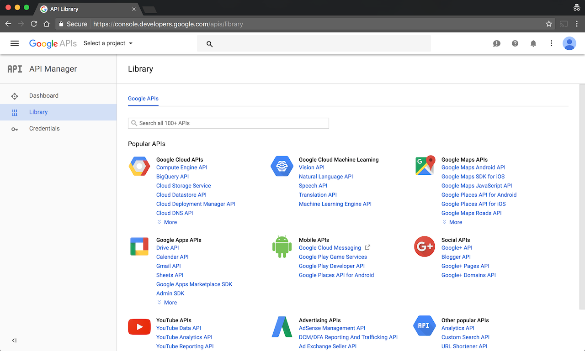</a>
- In the API search box, type “Google Sheets API”. When it comes up, click on "Google Sheets API."
<a href="images/hw5-gsa-sheets-search.png">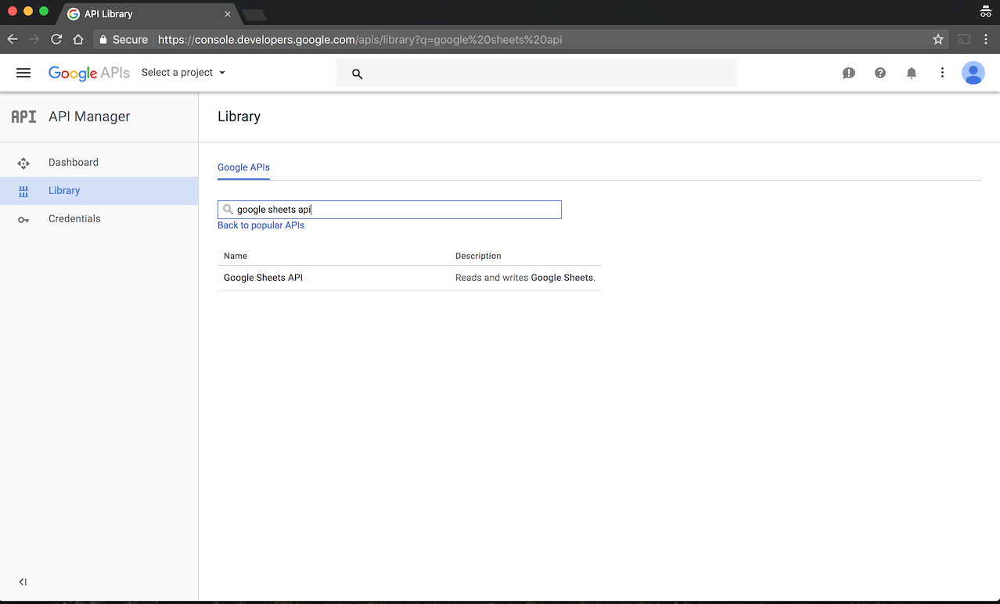</a>


### 2. Create a project
{:.no_toc}

- You will now need to create a project. Click the "Create Project" button.
<a href="images/hw5-gsa-create-project.png">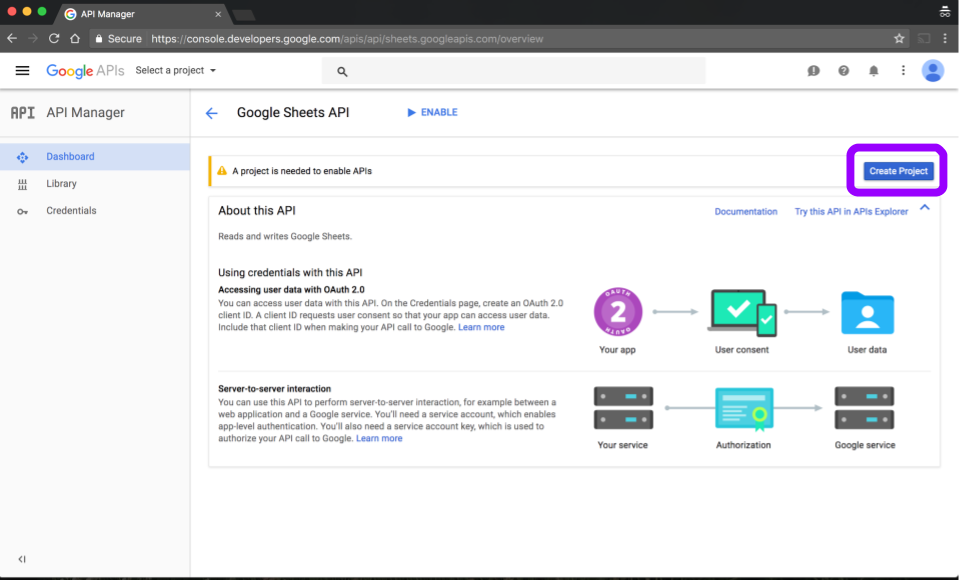</a>
- You may get a dialog message that looks like the one below. If you do, click "Create".
<a href="images/hw5-gsa-weird-dialog.png">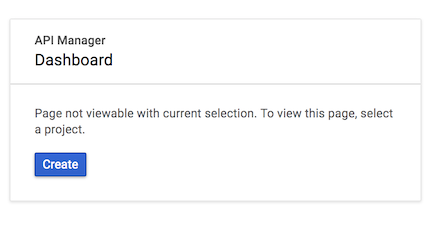</a>
- Enter any project name, such as "CS193x HW5."
<a href="images/hw5-gsa-new-project.png">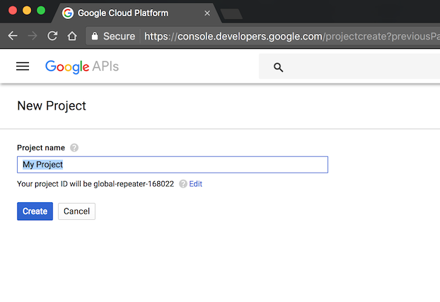</a>
- You will see an [intermediate loading screen](images/hw5-gsa-new-project-loading.png), then it will take you back to the Google Sheets API page.
<a href="images/hw5-gsa-sheets-api-again.png">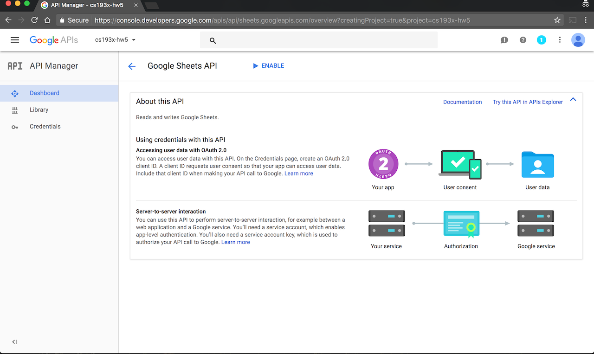</a>

### 3. Enable the API
{:.no_toc}

- Click the "Enable" button. You will be taken to the Credentials page.
<a href="images/hw5-gsa-enable-sheets.png">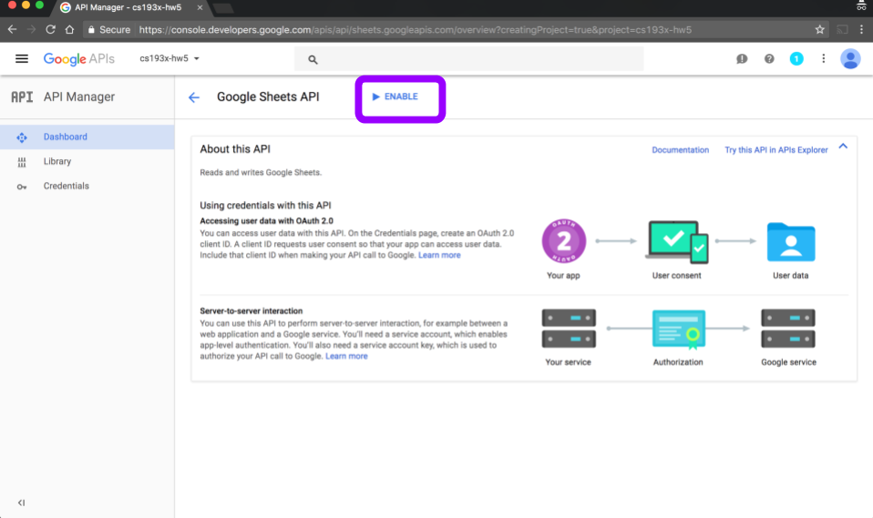</a>

### 4. Create Google Service Account + key
{:.no_toc}

- Click the "Create Credentials" button. This will take you to the Credentials wizard.
<a href="images/hw5-gsa-create-credentials.png"></a>
- Fill out the first part of the wizard as follows:
  - Which API are you using? **Google Sheets API**
  - Where will you be calling the API from? **Web server**
  - What data will you be accessing? **Application data**
  - Are you using Google App Engine or Google Compute Engine? **No, I’m not using them**
- Then click "What credentials do I need?" This will prompt you to create a Google Service Account.
<a href="images/hw5-gsa-create-creds-wizard.png">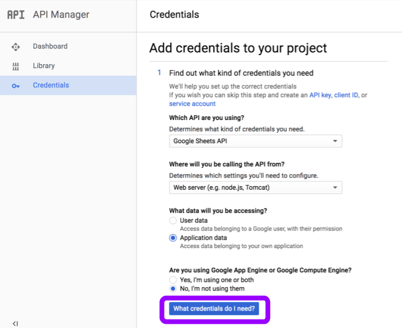</a>
- Fill out "Create a service account" second part of the form as follows:
  - Service account name: Any name you'd like, e.g. "**HW5 sheets**"
  - Role: **Project -> Owner**
  - Key type: **JSON** (this is selected by default)
- Then click "Continue."
<a href="images/hw5-gsa-get-creds.png">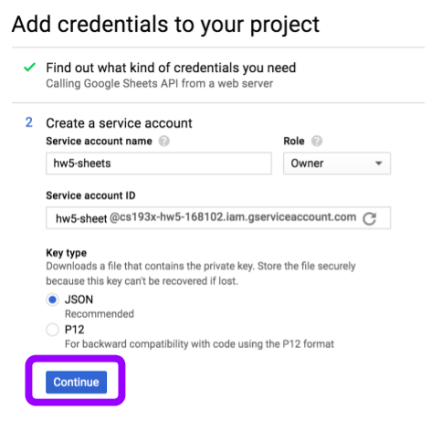</a>
- This will immediately download your Google Service Account credentials JSON file for you.
  - **Make note of where this file was downloaded!** We will refer to this file again soon.
<a href="images/hw5-gsa-creds-downloaded.png">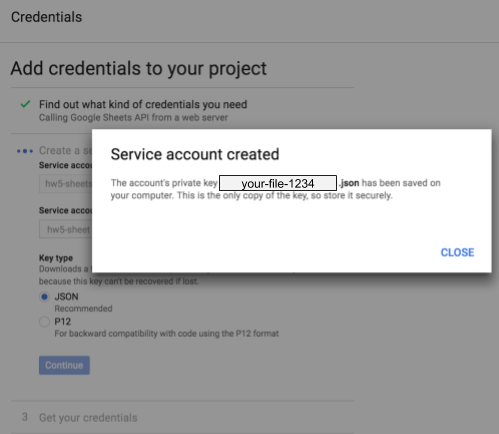</a>

### 5. Add Google Drive API
{:.no_toc}

- After you've created a Google Service Account, you will be taken back to the Credentials screen. From this screen, click "Library" on the left sidebar.
<a href="images/hw5-gsa-search-drive.png">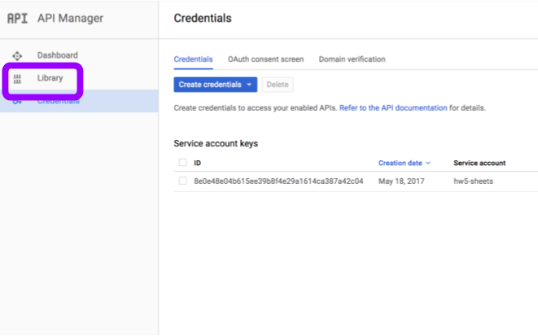</a>
- Search for "google drive api," then click on "Google Drive API" when it comes  up.
<a href="images/hw5-gsa-add-drive-api.png"></a>
- Click "Enable", like you did for the Google Sheets API
<a href="images/hw5-gsa-enable-drive.png">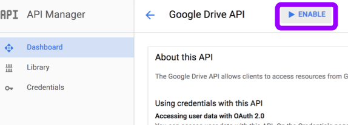</a>

We are now done with the Google Developers Console.

### 6. Copy GSA credentials to `privateSettings.json`
{:.no_toc}

- In Atom, open the credentials JSON file that was downloaded for you at the end of Step 4. It should look something like this:
<a href="images/hw5-gsa-json.png"></a>
  - The most important entries are the `private_key` and `client_email` fields.
- In Atom, also open your HW5 starter code and the `privateSettings.json` file. `privateSettings.json` should be completely empty.
- Now copy the contents of the credentials JSON file into `privateSettings.json`.

</section>

<section class="part" markdown="1">
## 3. SETUP: Create a GSA spreadsheet

In this section, you will create a special Google spreadsheet to which your NodeJS server will be able to write data. To do this, you will need to create a spreadsheet via the `cs193x-sheets` command-line tool, distributed on `npm`.

### 1. Install `cs193x-sheets`
{:.no_toc}

- In your terminal, navigate to the directory that contains the HW5 starter code you downloaded from GitHub.
  - If you need help working a terminal, [see guide here]({{relative}}install-node)
<a href="images/hw5-starter-directory.png">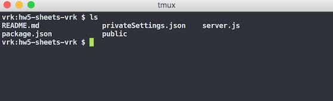</a>
- Run `npm install -g cs193x-sheets` to install the cs193x-sheets command-line tool.
  - You may need to use `sudo`.
  - You will use this command-line tool to create spreadsheets that your NodeJS server can write to.
<a href="images/hw5-install-sheets-tool.png">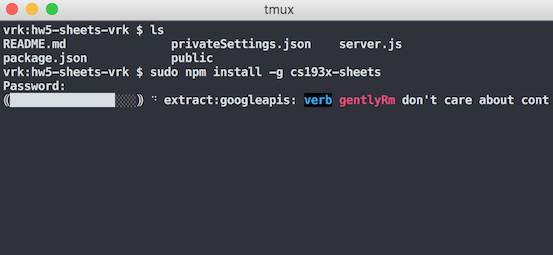</a>
<a href="images/hw5-sheets-tool-installed.png">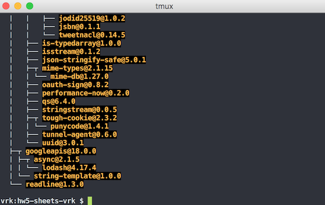</a>

### 2. Run `cs193x-sheets`
{:.no_toc}

- Now run the `cs193x-sheets` command:
<a href="images/hw5-sheets-prompt.png">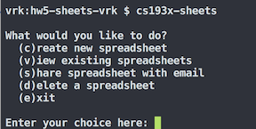</a>
- Type "c" to create a new spreadsheet and enter the following:
  - Title of spreadsheet: Anything you'd like, e.g. "**HW5 spreadsheet**"
  - Enter your email: Your email address (must be a Gmail-enabled account, such as @gmail or @stanford)
- Afterward the tool will print out "Spreadsheet created" with the URL of your new spreadsheet.
  - The only people who can access this spreadsheet are you (via the email you entered) and the course staff.
<a href="images/hw5-spreadsheet-created.png">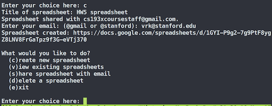</a>

**NOTES:**

Technically the spreadsheet you just created is owned by your Google Service Account, and not your public Gmail account, which is why you need to use the command-line tool to create and manage the spreadsheet. You cannot access Google Service Account documents via Google's web interface.

Also, you must always run `cs193x-sheets` in the same directory as `privateSettings.json`, so that it can access your Google Service Account credentials.

### 3. Open your spreadsheet and fill with some fake data
{:.no_toc}

- Open the spreadsheet you just created via command-line
- Fill it out with fake data [like in this spreadsheet](https://docs.google.com/spreadsheets/d/1GYI-P9g2-7g9PtF8ygZ8LNV8FrGaTpz9f3G-eVTj370/edit?ts=591e76d4#gid=0)
  - **The first row of your spreadsheet should be the column labels.**
<a href="images/hw5-sheet-data.png">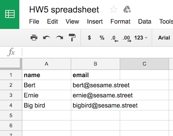</a>
</section>

<section class="part" markdown="1">
## 4. SETUP: Set up the starter code

At last, you are ready to configure the starter code and get working on the assignment!

### 1. Set `SPREADSHEET_ID` in `server.js`
{:.no_toc}

- Open `server.js` from the HW5 starter code in Atom
- Change the value of SPREADSHEET_ID to the ID of your spreadsheet. This is the long series of numbers, letters, and dashes after the `d/` in the Google Spreadsheets URL.
  - For example, in `https://docs.google.com/spreadsheets/d/1GYI-P9g2-7g9PtF8ygZ8LNV8FrGaTpz9f3G-eVTj370`, the Spreadsheet ID is **1GYI-P9g2-7g9PtF8ygZ8LNV8FrGaTpz9f3G-eVTj370**
  <a href="images/hw5-sheet-id.png">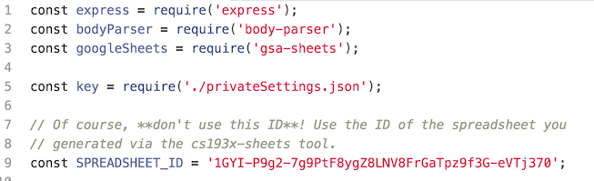</a>

### 2. Run `npm install`
{:.no_toc}

- In the terminal, make sure you are still in the directory that contains the HW5 starter code you downloaded from GitHub.
- Run `npm install`
  <a href="images/hw5-install-deps.png">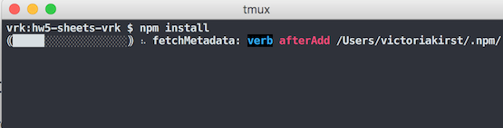</a>
  <a href="images/hw5-install-deps-finished.png">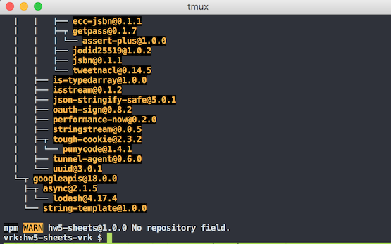</a>

### 3. Run `npm start`
{:.no_toc}

- Now run `npm start` to start your server. You should see the "Server listening on port 3000!" message.
  <a href="images/hw5-run-server.png">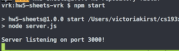</a>


### 4. Test `http://localhost:3000`
{:.no_toc}

- Navigate to `http://localhost:3000`
- You should see a fully-implemented test page that you will use to test your backend.
<a href="images/hw5-test-page.png">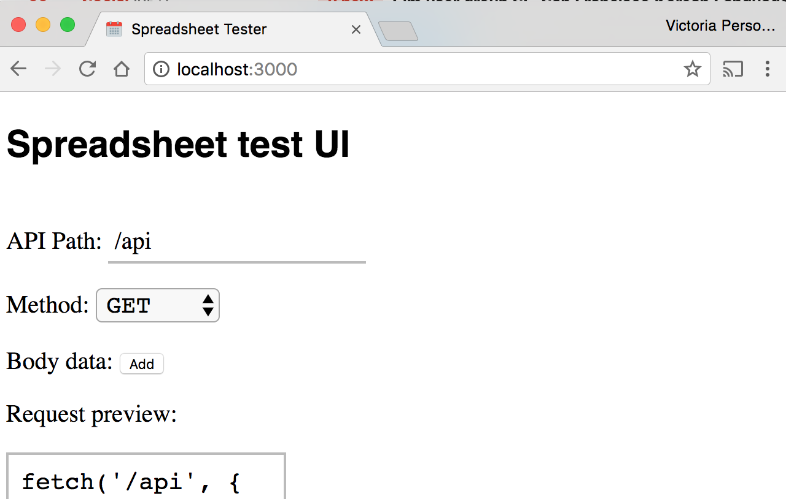</a>

- On the test page, click the "FETCH" button.
- After a few seconds, you should see the following at the bottom of the page:
<a href="images/hw5-fetch-status.png">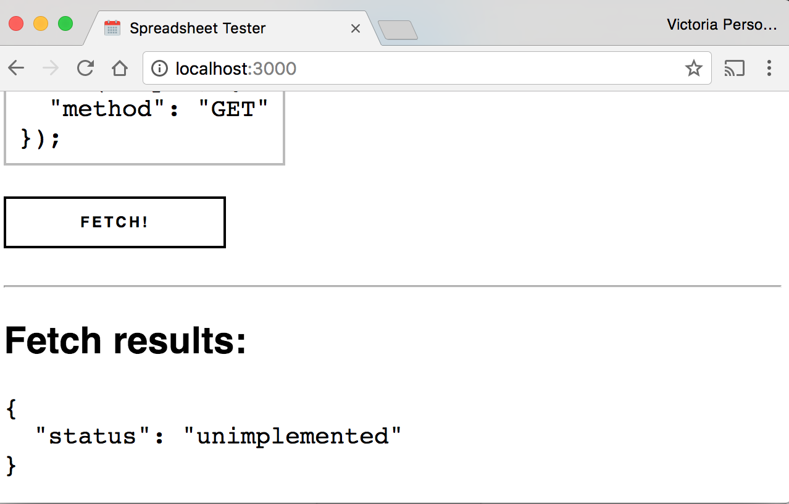</a>
- On the terminal where your server is running, you should see what the output of `console.log(rows)`:
<a href="images/hw5-query-result.png">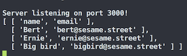</a>

### 5. Change and reload server
{:.no_toc}

Every time you change the code in `server.js`, you will have to kill and rerun your server process. Let's practice that here to make sure you understand your development workflow.

- Modify `server.js` in trivial ways:
  - Have it print a slightly different message after the server process is bound to port 3000.
  - Have it return `{ status: 'unimplemented!!!'}` in response to a GET request.
<a href="images/hw5-code-change-print.png">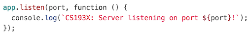</a>
<a href="images/hw5-code-change-return.png">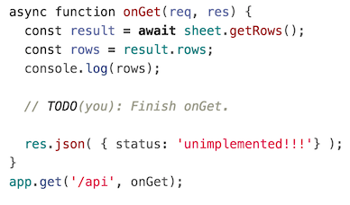</a>
- Return to the terminal and stop the current node server by pressing `CTRL-C`
- Now rerun `npm start`
  - Verify the terminal prints you updated message
  <a href="images/hw5-npm-restarted.png">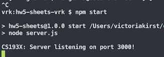</a>
- Navigate to `http://localhost:3000` and click "Fetch"
  - Verify the result returned is updated.
  <a href="images/hw5-return-updated.png">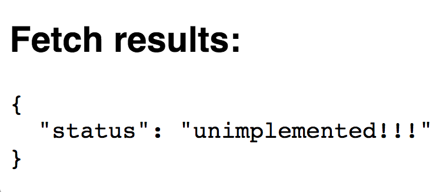</a>

</section>

<section class="part" markdown="1">

## Using the `gsa-sheets` node module

To update the spreadsheet, you will be using the `gsa-sheets` Node library.

The starter code already creates a `Sheet` object for you:

```javascript
const sheet = googleSheets(key.client_email, key.private_key, SPREADSHEET_ID);
```

And the `onGet()` function calls and prints the results of the `sheet.getRows()` method:

```javascript
const result = await sheet.getRows();
const rows = result.rows;
console.log(rows);
```

Here are the public methods of a `Sheet` object:

Method name | Description
--- | ---
`getRows()` | Returns the rows in the spreadsheet. This is an asynchronous function that returns a `Promise` that resolves to a JSON object with one property, `rows`. The value of `rows` is an array of the spreadsheet's row values, also stored in an array. For example, if you have a spreadsheet that looks like this: [screenshot](images/hw5-sheet-data.png), the value of "result" in a call to `const result = await sheet.getRows()` will look like this: [screenshot](images/hw5-getrows-json.png) .
`appendRow(newRow)` |  Adds the given row to the end of the spreadsheet. This is an asynchronous function takes an Array parameter, `newRow`. The array contains the list of values in order to add to the end of the spreadsheet. For example, a call to `sheet.appendRow([1, 2, 3])` would add a row where the first value was 1, the second value was 2, and the third value was 3.<br/><br/>`appendRow` returns a `Promise` that resolves to a result object, which will equal `{ success: "true" }` if the operation was successful, or `{ error: <error message> }` if the operation failed.
`deleteRow(rowIndex)` | Deletes the given row in the spreadsheet. The `rowIndex` indicates the 0-based row number of the spreadsheet, where the first row is 0, the second row is 1, etc.<br/><br/>`deleteRow` returns a `Promise` that resolves to a result object, which will equal `{ success: "true" }` if the operation was successful, or `{ error: <error message> }` if the operation failed.
`setRow(rowIndex,newRow)` | Sets a particular row in the spreadsheet to the given values. This is an asynchronous function takes two parameters, `rowIndex` and `newRow`. The `rowIndex` indicates the 0-based row number of the spreadsheet, where the first row is 0, the second row is 1, etc. The `newRow` is an array of values in the order that they should be set.<br/><br/>`setRow` returns a `Promise` that resolves to a result object, which will equal `{ success: "true" }` if the operation was successful, or `{ error: <error message> }` if the operation failed.


**Bugs?**
- If you believe there is a bug in the `gsa-sheets` library, post to Piazza.


</section>

<section class="part" markdown="1">

## Milestone 1: Implement GET

When you send a GET request to `http://localhost:3000/api`, the server should reply with a JSON representation of the spreadsheet as described below:
- Return an array of objects, where each object represents a row:
  - Each object should be key-value pairs of the form `column: value`

For example, if your spreadsheet that looks like this:

<a href="images/hw5-sheet-data.png"></a>

Then a GET request to `http://localhost:3000/api` should return JSON that looks like:


```json
[
  {
    "name": "Bert",
    "email": "bert@sesame.street"
  },
  {
    "name": "Ernie",
    "email": "ernie@sesame.street"
  },
  {
    "name": "Big bird",
    "email": "bigbird@sesame.street"
  }
]
```

**Spreadsheet Format:**

* You may assume the spreadsheet is **formatted perfectly**:
  - The first row of the spreadsheet contains the column names.
  - Every row with a value in it is filled out completely, i.e. there are no partially filled out rows. ([screenshot](images/hw5-invalid-partial-row.png))
  - All values belong to a named column ([screenshot](images/hw5-invalid-no-column.png))
  - There are no blank rows in between filled out rows. That is, it's not possible for row 5 and row 7 to be filled out, but row 6 to be blank. ([screenshot](images/hw5-invalid-skipped-row.png))

---

**Testing GET:**

Use the test page located at `http://localhost:3000/` to verify your result. Here's a screenshot of what the test page looked like after clicking the "Fetch" button:


<a href="images/hw5-test-page-get.png">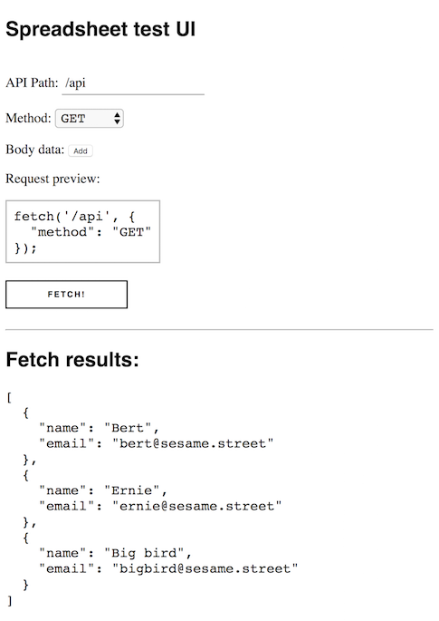</a>

---

</section>

<section class="part" markdown="1">

## Milestone 2: Implement DELETE

When you send a DELETE to `http://localhost:3000/api/` with route parameters **`column-name/value`** your server will delete the first row whose column value matches the given parameter.
- In other words, a DELETE request to `http://localhost:3000/api/name/Anderson` would delete the first row whose "name" value was "Anderson."

**DELETE request details:**
- If there are multiple rows that match the given parameter, delete the first matching row.
- If there are no rows whose value matches the given parameter, you should still return a success response but the spreadsheet should not change.
- For simplicity, **you do not have to support case insensitivity**; that is extra credit. In other words, if your column name is "email", you do not have to make your DELETE request work with `api/Email/o@thegrouch.net`. Similarly, if a row value for "name" is "Anderson", you do not have to delete that row if the DELETE request is for `api/name/anderson`

**DELETE response:**

Your server should respond with a success message after updating the spreadsheet, or when your server determines spreadsheet should not be updated.

```json
{
  "response": "success"
}
```

---

**Testing DELETE:**

This example assumes your spreadsheet looks like this:

<a href="images/hw5-test-post-sheet-after.png">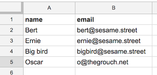</a>

Use the test page located at `http://localhost:3000/` to verify your result:
- Set the API path to `/api/name/Ernie`
- Set the "Method" to `DELETE`

Here's a screenshot of what the test page looked like after clicking the "Fetch" button:

<a href="images/hw5-test-page-delete.png">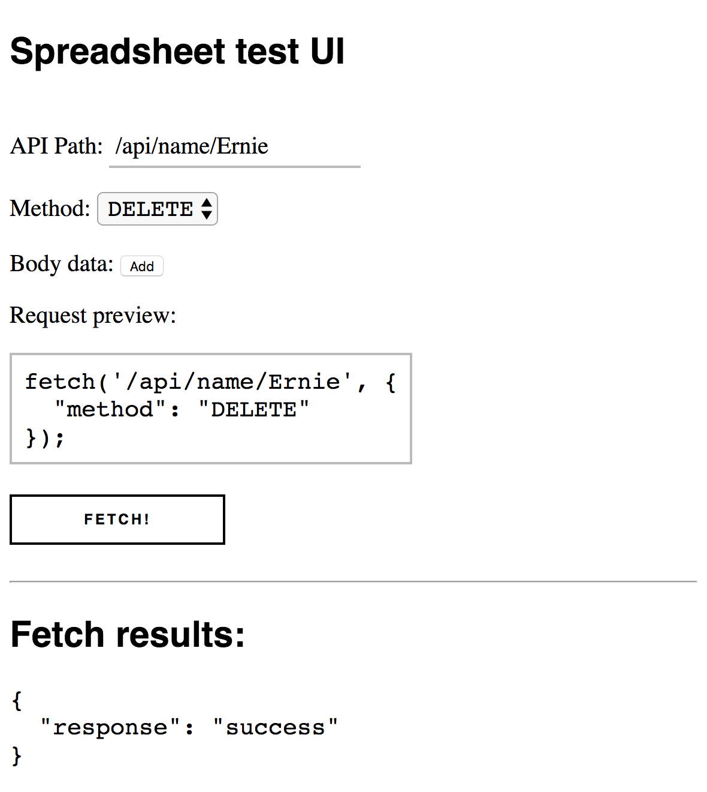</a>

And here's a screenshot of the updated spreadsheet:

<a href="images/hw5-test-delete-sheet-after.png">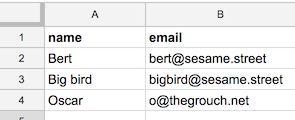</a>

</section>

<section class="part" markdown="1">

## Milestone 3: Implement POST

When you send a POST request to `http://localhost:3000/api` with a message body in the format described below, your server should append a row to the end of the spreadsheet.

**POST request details:**

- The message body will be a JavaScript object that represents the row to add to the spreadsheet.
- The JavaScript object contains key-value pairs of the form `column: value`
- For example, the message body might look like:
  ```json
  {
    "name": "Oscar",
    "email": "o@thegrouch.net"
  }
  ```
- The column-value pairs will **not necessarily** be defined in the same order as the columns in the spreadsheet. For example, another valid message body is the following:
  ```json
  {
    "email": "me@el.mo",
    "name": "Elmo"
  }
  ```
- You may, however, assume that the message body is **perfectly formatted**, i.e. the value for each column is filled out, and it does not specify any columns that don't already exist in the spreadsheet.
- For simplicity, you **do not** have to support case insensitivity; that is extra credit. In other words, if your column names are "name" and "email", you do not have to make your POST request work with `{ "Name": "Elmo", "Email": "me@el.mo" }`

**POST response:**

Your server should respond with a success message after updating the spreadsheet.

```json
{
  "response": "success"
}
```

---

**Testing POST:**

This example assumes your spreadsheet looks like this:

<a href="images/hw5-sheet-data.png"></a>

Use the test page located at `http://localhost:3000/` to verify your result:
- Make sure the API path is `/api`
- Set the "Method" to `POST`
- Click "Add" next to "Body data" twice and fill out these keys and values:
  - `name` : `Oscar`
  - `email` : `o@thegrouch.net`

Here's a screenshot of what the test page looked like after clicking the "Fetch" button:

<a href="images/hw5-test-page-post.png">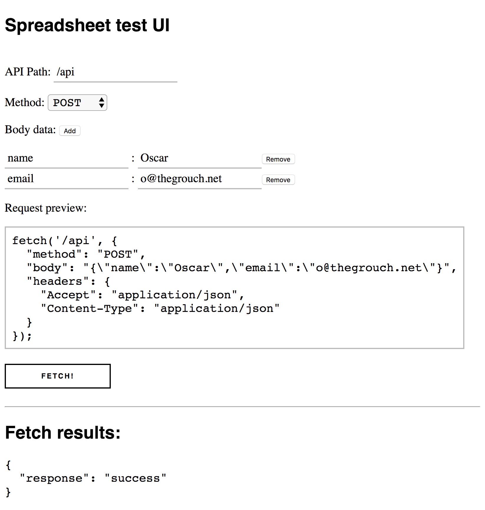</a>

And here's a screenshot of the updated spreadsheet:

<a href="images/hw5-test-post-sheet-after.png"></a>

</section>

<section class="part" markdown="1">

## EXTRA CREDIT: Implement PATCH

When you send a PATCH request to `http://localhost:3000/api` with route parameters **`column-name/value`** **and** a message body in the format described below, your server will update the first row whose column value matches the given parameter, with the values as described in the message body.

**PATCH request details:**

- The message body will be a JavaScript object that represents the column values to update for the row.
- The JavaScript object contains key-value pairs of the form `column: value`
- For example, you might have a PATCH request `http://localhost:3000/api/name/Oscar` with a message body that looks like:
  ```json
  {
    "email": "me@osc.ar"
  }
  ```
- The JavaScript object will **not necessarily** contain every column in the spreadsheet.
- You may assume that the message body keys are valid, i.e. the object only refers to columns that exist in the spreadsheet.
- If there are multiple rows that match the given parameter, update the first matching row.
- If there are no rows whose value matches the given parameter, you should still return a success response but the spreadsheet should not change.
- For simplicity, you **do not** have to support case insensitivity; that is extra credit.

**PATCH response:**

Your server should respond with a success message after updating the spreadsheet.

```json
{
  "response": "success"
}
```

---

**Testing PATCH:**

This example assumes your spreadsheet looks like this:

<a href="images/hw5-test-page-post.png"></a>

Use the test page located at `http://localhost:3000/` to verify your result:
- Set the API path to `/api/name/Ernie`
- Set the "Method" to `PATCH`
- Click "Add" next to "Body data" twice and fill out these keys and values:
  - `email` : `me@ernie.com`

Here's a screenshot of what the test page looked like after clicking the "Fetch" button:

<a href="images/hw5-test-page-patch.png">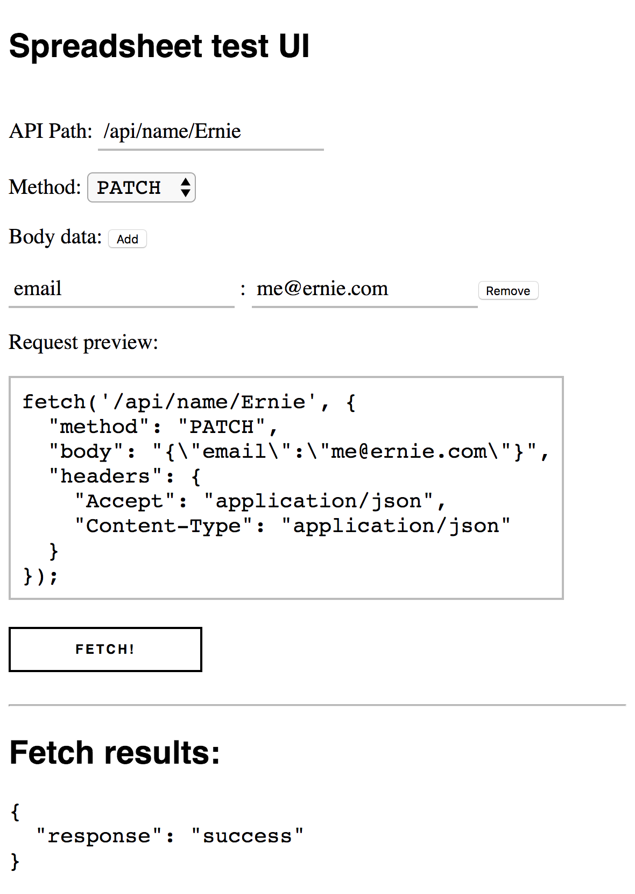</a>

And here's a screenshot of the updated spreadsheet:

<a href="images/hw5-test-patch-sheet-after.png">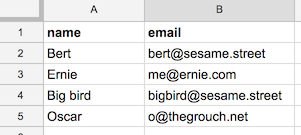</a>

</section>

<section class="part" markdown="1">

## EXTRA CREDIT: Case-insensitive search

For extra credit, make your server support case-insensitive search for:
- DELETE
- PATCH
- POST

**TODO(vrk):** Add details.

</section>

<section class="part" markdown="1">

## Submit

Upload your completed homework to your GitHub repository. However, this time **you do not have to publish your page on GitHub**, as this is a server and not a client-side web page.

Instead, please follow the instructions below to deploy your app to [Heroku](http://heroku.com).

### Deploy to Heroku
{:.no_toc}

- Create a [free Heroku account](https://signup.heroku.com), if you don't have one already
- Once your account is created and verified, you can deploy your app by visiting the following link (of course, replace `<YOUR-REPOSITORY-NAME>` with the name of your repository, such as `hw5-sheets-mygithubname`):
  - `https://heroku.com/deploy?template=https://github.com/yayinternet/<YOUR-REPOSITORY-NAME>`
- When the page loads, click the purple "Deploy" button.
- When the deployment finishes, you should see "Your app was successfully deployed." Click the "View" button.
  - This will take you to your deployed app, which will look like `http://some-autogenerated-name.herokuapp.com`

**Trouble with deploying**
- If your deployment isn't working, feel free to post to Piazza or come to office hours.
- If you really can't get it working, turn in your homework anyway; we are not requiring you to deploy to Heroku. However, deploying your app to Heroku will greatly help our TAs when grading, so please try your best to get it working.

### Turn in homework
{:.no_toc}
Turn in the link to your GitHub repository and Heroku app here:
- [Submission Form](https://goo.gl/forms/LuTWdK9S3510x5ys1)

</section>
