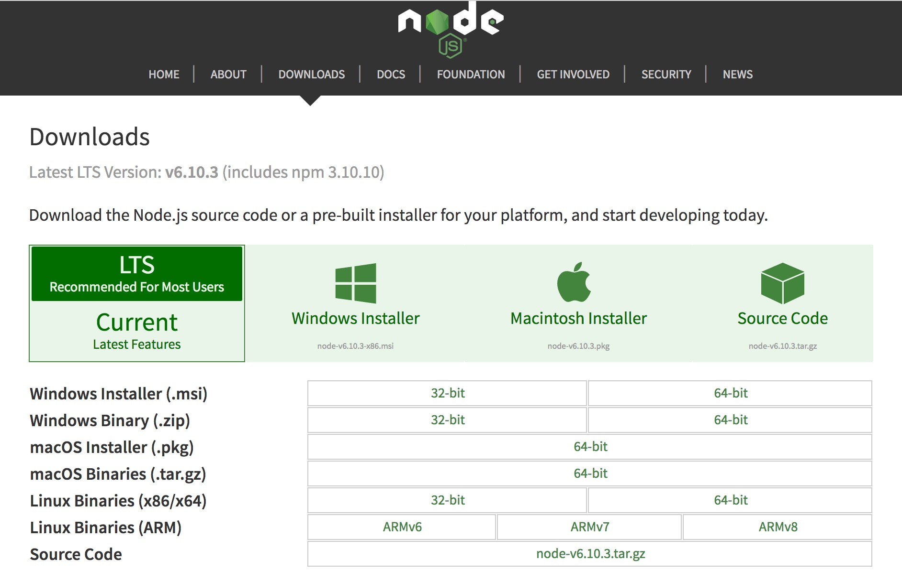
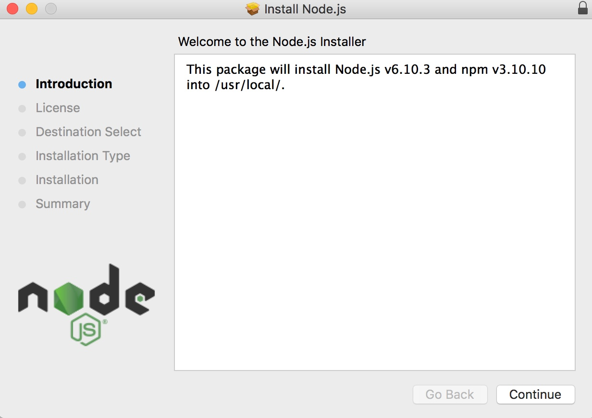
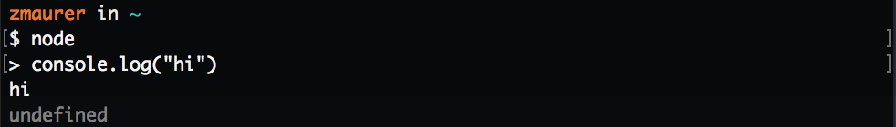
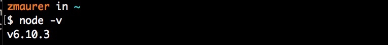
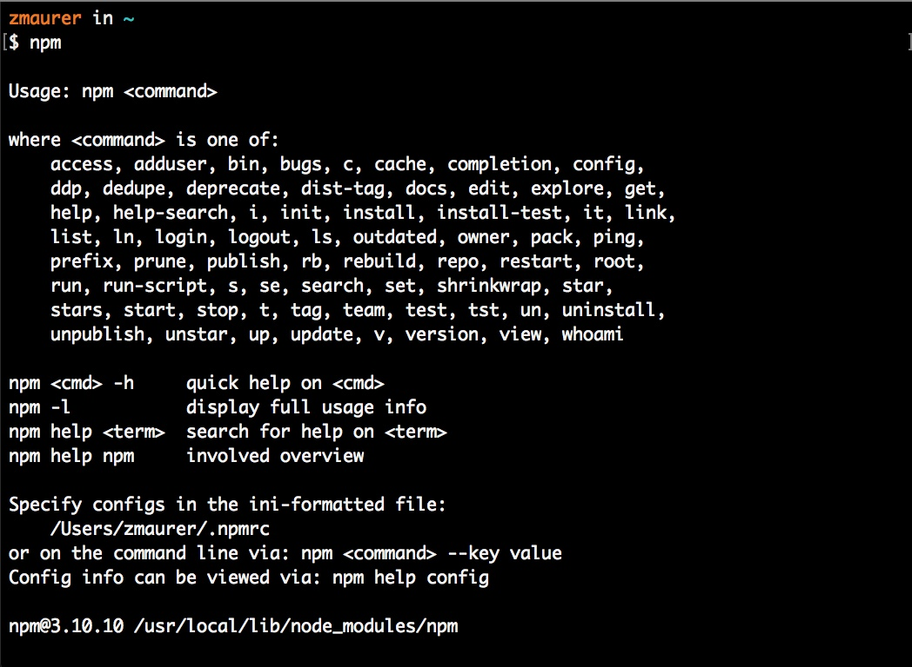
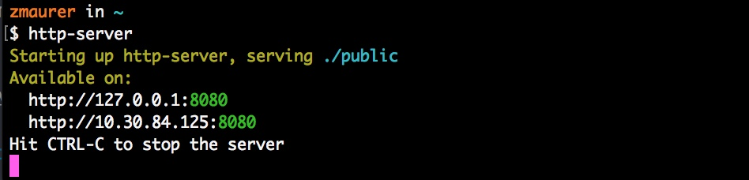
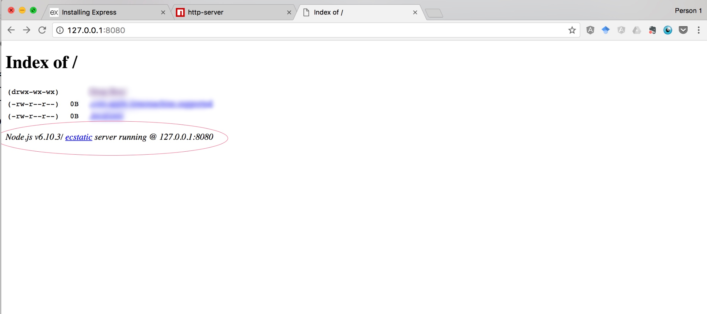


../

This tutorial has sections covering the following topics:

* TOC
{:toc}

If you have any trouble installing Node, please [post to Piazza](http://piazza.com/stanford/spring2017/cs193x).

<section class="part" markdown="1">

## Installing Node.js

### 1) Download Installer
{:.no_toc}

* Navigate to [https://nodejs.org/en/download/](https://nodejs.org/en/download/)
* Select and download the installer for your operating system.
  * Most contemporary laptops will use a 64-bit distribution.
* Download the LTS version (stable) instead of the current (bleeding edge)



### 2) Follow GUI installation instructions
{:.no_toc}

* Just follow the prompts.
* For Macs: If this installation process fails, it is possibly due to the recent System Integrity Protection feature added in El Capitan and subsequent versions of MacOS. Refer to [this section](#node-wont-install-on-mac) to disable SIP and then run the node installer again.




### 3) Testing Node.js
{:.no_toc}

* Open up Terminal (or your Windows command line interface)
* Type `node` after the command prompt and hit Enter
* You should get a JavaScript REPL, similar to the console in the Chrome inspector.
* Try a single line of JavaScript to test it out.
* Hit Ctrl-C twice to exit the REPL
* Run `node -v` in terminal and then make sure you have `v6.10.3` installed.





### 4) Testing NPM
{:.no_toc}

`NPM` stands for `Node Package Manager`. Packages are like libraries. The Node runtime has provided a handy way of accessing, installing and managing these libraries.

* At the command line, type `npm` after the command prompt and hit Enter
* You should see the following:
  

### 5) OPTIONAL: Install `http-server`
{:.no_toc}

The `http-server` command is the NodeJS equivalent of Python's `SimpleHTTPServer`. This is not necessary for CS193X, but you may find it useful in general.

* Download `http-server` by running `npm install http-server -g` at the command line.
* Documentation for `http-server`: `https://www.npmjs.com/package/http-server`
* You will see a progress bar and a bunch of text ouput.
* Spin up a local server by running `http-server` at the command line.
* You should see the following:
  
* Visit the address specified on the command line in your browser (in this case `http://127.0.0.1:8080`)
* You should see the following (note the node.js runtime in the red circle):
  

</section>

<section class="part" markdown="1">
## Basic Command Line Skills

We are not going to be teaching command line skills in class, as it was considered prerequisite knowledge for CS193x. However, we will provide some basic help below.

Skip this section if you are already familiar with command line interfaces.

### Concepts
{:.no_toc}

* The command line is just another way of controlling your computer.
* It is a _textual_ interface. The icons that you commonly interact with (i.e. click on) are parts of a _graphical_ user interface. They can accomplish many of the same things!
* For most development work, a CLI (command line interface) is much more expedient because it allows you to work more fluidly with code and run code/commands that do not have a graphical user interface. At the command line, you are navigating the same filesystem and computer that you would in Finder or any Filesystem explorer.
* However, you have way more control over what you can see and do. This is really powerful, but with great power comes great responsibility. You don't need to be scared of the command line, but you do need to recognize that it's not the time to "guess" whether you are about to run the right command. Some commands can be very problematic, such as deleting large amounts of your filesystem (and skipping the trashbin...). We will not be mucking about too much with the command line (and no, it's not dangerous to leave it running when you're not looking), but please be aware of blindly copying-and-pasting code from StackOverflow and running it without consideration. These types of scenarios can end poorly.

### Some basic commands
{:.no_toc}

Note:
* The `$` character signals the beginning of a shell prompt. The _shell_ is the execution environment for commands. You can think of it as the "session".
* Lines starting with `#` are comments. These commands are mostly Mac-centric, but most will work on Linux and possibly Windows. (You should check before running.)
* Lines starting with `>` are the _shell's_ outputs.


```bash
# Clears visual display, does not delete any files.
$ clear
```

```bash
# Print the current working directory -- aka "where am I?"
$ pwd
> /Users/someplace/somewhere/folder/code
```

```bash
# Change directory -- aka "move from one folder to another"
# After typing `cd ` you can hit Tab once or twice and it will autocomplete or
# list the possible folders you can visit
$ cd   
# The dot-dot stands for the parent directory. It means to go one directory "up."
$ cd ..
# You can navigate multiple folders in one go:
$ cd somefolder/place/code/ 	
```

```bash
# List the files in a directory -- aka "whats in this folder?"
$ ls
> Somefolder	Code	Photos
> Dogpictures	GIFs	CS193X
> rootkit		script.py
>
$ ls *.py 	# you can use regular expressions!
> script.py
```

```bash
# Makes a new directory -- aka "makes a new folder"
$ mkdir hw5
$ ls
> Code	Random 	hw5
$ cd hw5
$ pwd
> ~/User/somefolder/hw5
```

```bash
# Opens the GUI file explorer -- aka "where is this in Finder?"
# Opens the current directory in Finder (the dot is the current directory)
$ open .
# Opens the directory "someFolder" in Finder
$ open someFolder
# Uses the system default program to open this file
$ open somefile.py
```

### A note on deleting files
{:.no_toc}

* If you are a first-time command line user, I recommend using the `open` command to open the directory you want to work in, and then use Finder to delete the files you want, as you would normally.

* You also can use the `rm` command, but if you're new, I would recommend getting familiar with everything first and then working with `rm`.

Further References:

* [https://practicalunix.org/](https://practicalunix.org/) or (CS1U: Practical Unix)
* Unix manpages: run `man [command]` to see the complete, but verbose and sometimes hard to understand, documentation for that command.
</section>

<section class="part" markdown="1">

## Troubleshooting

This section contains information on how to debug problems with installing Node.

### Node won't install on Mac
{:.no_toc}

If Node doesn't install on Mac, it might be due to the System Integrity Protection (SIP) added in El Capitan. Try disabling SIP using the instructions below.

**NOTE:** While there is no real harm in removing the System Integrity Protection feature on Mac, you don't need to follow these instructions unless you had problems with your original Node installation.

Full instructions from [MacWorld UK](http://www.macworld.co.uk/how-to/mac/how-turn-off-mac-os-x-system-integrity-protection-rootless-3638975/)

_Disclaimer:_ We are disabling a security feature installed by Apple. This is necessary for many CS-related development activities, but it is not something everyone does on their laptop. This guide is not liable for any damage caused to your files or computer. It is _very_ unlikely that disabling this feature could cause any negative side effects to your laptop, but if you're new to this process it is prudent to make a back-up.

* Back-up your computer and files. (Up to you.)
* Shutdown your Mac
* Hold down Command-R and press the Power button. Keep holding Command-R until the Apple logo appears.
* Wait for OSX to boot into the OSX Utilities window.
* On the upper toolbar menu, choose `Utilities` > `Terminal`
* Type `csrutil disable` at the command line and hit Enter
* Type `reboot` at the command line and hit Enter
* Your Mac will now restart.
* After booting up, open Terminal.
* Type `csrutil status`.
* You should see this message: `System Integrity Protection status: disabled.`
* Continue to installing packages specified above.

After installing the above software, you may want to re-enable SIP. Following roughly the same instructions as above:

* Back-up your computer and files. (Up to you.)
* Shutdown your Mac
* Hold down Command-R and press the Power button. Keep holding Command-R until the Apple logo appears.
* Wait for OSX to boot into the OSX Utilities window.
* On the upper toolbar menu, choose `Utilities` > `Terminal`
* Type `csrutil enable` at the command line and hit Enter
* Type `reboot` at the command line and hit Enter
* Your Mac will now restart.
* After booting up, open Terminal.
* Type `csrutil status`.
* You should see this message: `System Integrity Protection status: enabled.`

</section>
<section class="part" markdown="1">

## Credits
{:.no_toc}

This tutorial was written by our TA Zach Maurer. Thanks, Zach!
</section>
